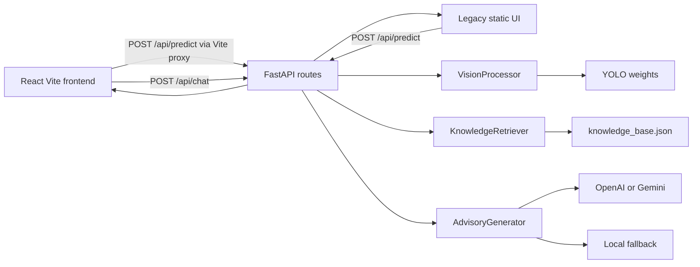
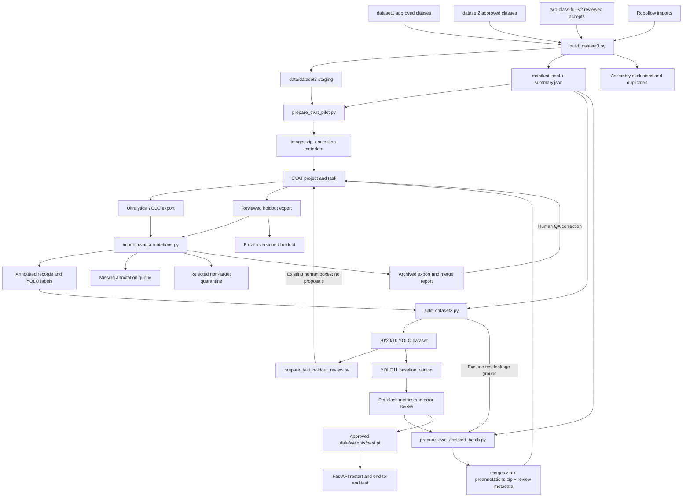

# FoodSense-MY Architecture

## System Overview

FoodSense-MY contains two related systems:

1. a FastAPI backend plus a React (Vite) frontend that detect six Malaysian dishes and return verified nutrition plus an optional LLM-formatted advisory;
2. a local data pipeline that acquires, curates, consolidates, annotates, splits, trains, and promotes the custom detector.

The application is runnable. Dataset consolidation, the first CVAT pilot, its Phase A priority audit, the Phase B leakage-safe split, the Phase C YOLO11n pilot, the reviewed Phase D batch 001–010 merges, the no-proposal test-holdout audit, four locked incremental splits (`dataset3-interim-v2` through `dataset3-interim-v5`), four interim HPC retrains (`dataset3_interim_v2` through `dataset3_interim_v5`), and curated Mee Goreng web ingest (`ingest_mee_goreng_full`, +251) are complete. Batch 010 drained the annotation backlog: Dataset3 now has 5,246 annotated images / 5,579 boxes, with only 43 unreachable missing frames. Interim v5 remains the production-approved checkpoint (validation mAP50–95 0.793, Mee Goreng recall 0.778; locked-test done). Phase E is complete: validation-only threshold calibration (confidence 0.47, NMS-IoU 0.45; macro-F1 0.891), the single locked-test evaluation (mAP50 0.926, mAP50–95 0.678), and production promotion to `data/weights/best.pt` are done, and the app was smoke-tested against the promoted weights. Later HPC candidates on the same split: v6_s (yolo11s, val mAP50–95 0.826) and v7_n_freeze (yolo11n, 0.820, MG recall 0.722); interim v8 (YOLO11n MG recovery + localization) is planned.

## Tech Stack

| Layer | Technology | Location |
|-------|------------|----------|
| Frontend (primary UI) | React 18 + Vite | `frontend/` (`npm run dev` → http://localhost:5173) |
| Backend API | FastAPI + Uvicorn | `backend/app/` |
| Detection | Ultralytics YOLO11n + OpenCV + PyTorch (MPS/CPU/CUDA) | `backend/app/services/vision_service.py` |
| Nutrition | Local JSON knowledge base | `data/knowledge_base.json` |
| Advisory | OpenAI or Gemini (optional); template fallback | `backend/app/services/llm_service.py` |
| Legacy static UI | Vanilla HTML/CSS/JS (still mounted by FastAPI) | `backend/app/static/` |
| Training / data pipeline | Python scripts, CVAT, Optuna | `training_scripts/`, `data/` |

The React app talks to the API through the Vite dev-server proxy (`/api` and
`/uploads` → `http://127.0.0.1:8000`). That avoids cross-origin calls; FastAPI
CORS currently allows only `localhost:8000` / `127.0.0.1:8000`. The bundled
static UI at port 8000 remains as a no-npm fallback; day-to-day local testing
uses the React frontend.



## Canonical Class Contract

Class IDs are a cross-system contract shared by dataset3 labels, CVAT, Ultralytics training, inference responses, and the nutrition knowledge base.

| ID | Class key | Display name |
|---:|-----------|--------------|
| 0 | `nasi_lemak` | Nasi Lemak |
| 1 | `roti_canai` | Roti Canai |
| 2 | `char_kuey_teow` | Char Kuey Teow |
| 3 | `chicken_rice` | Chicken Rice |
| 4 | `laksa` | Laksa |
| 5 | `mee_goreng` | Mee Goreng |

Never reorder these IDs in CVAT exports or `data.yaml`. Human annotation is authoritative when an image's source folder disagrees with its actual contents.

## Application Request Flow

1. The browser uploads an image.
2. `backend/app/api/routes.py` validates and stores it under `backend/app/static/uploads/`.
3. `VisionProcessor` preprocesses with OpenCV and runs YOLO with the configured confidence and IoU thresholds on MPS or CPU.
4. `KnowledgeRetriever` maps detected canonical classes to verified records in `data/knowledge_base.json`.
5. `AdvisoryGenerator` formats those records through OpenAI, Gemini, or a local template fallback.
6. The response contains boxes, classes, confidence, nutrition, advisory text, processing time, and a mandatory disclaimer.
7. The React bottom-right chat widget is always available (photo upload optional). It calls `POST /api/chat` with the user message, short history, optional last-scan context, and the server always attaches the verified knowledge-base snapshot so general Malaysian-food questions work without a scan. `AdvisoryGenerator.generate_chat_reply` uses the configured LLM (or a template fallback) and must not invent nutrition numbers outside that JSON.

## Module Responsibilities

### Application modules

| Module | Main class | File | Responsibility |
|--------|------------|------|----------------|
| Entry point | — | `backend/app/main.py` | FastAPI construction, lifespan, CORS, static mounting |
| Routes | — | `backend/app/api/routes.py` | Health, classes, prediction, and chat endpoints with dependency injection |
| Configuration | `Settings` | `backend/app/core/config.py` | Paths, thresholds, device, providers, and canonical classes |
| Security | — | `backend/app/core/security.py` | Upload validation and optional API key |
| Schemas | — | `backend/app/models/schemas.py` | Pydantic request and response contracts |
| Vision | `VisionProcessor` | `backend/app/services/vision_service.py` | OpenCV preprocessing, YOLO inference, and NMS |
| Nutrition | `KnowledgeRetriever` | `backend/app/services/data_service.py` | Local JSON knowledge-base lookup |
| Advisory | `AdvisoryGenerator` | `backend/app/services/llm_service.py` | Formatting-only LLM advisory, chat replies, and deterministic fallbacks |
| Frontend | — | `frontend/` | Primary React 18 + Vite UI; upload, analyze, result rendering, and bottom-right AI chat widget; proxies `/api` and `/uploads` to the backend |
| Legacy static UI | — | `backend/app/static/` | Vanilla HTML/CSS/JS fallback still mounted by FastAPI at `/` |

### Dataset and training modules

| Module | File | Responsibility |
|--------|------|----------------|
| Image acquisition | `training_scripts/scrape_images.py` | Coordinate Google, Bing, or SeleniumBase UC scraping and provenance |
| Google crawler | `training_scripts/google_crawler.py` | Hardened icrawler Google acquisition |
| UC crawler | `training_scripts/uc_crawler.py` | Undetected Chrome acquisition and recovered source URLs |
| Curation CLI | `training_scripts/curate_images.py` | Run pilot or calibrated curation |
| Curation engine | `training_scripts/curation.py` | Technical validation, SHA-256/dHash deduplication, OpenCLIP scoring, calibration, and routed views |
| Roboflow subset import | `training_scripts/import_roboflow_subset.py` | Validate, map, deduplicate, and preserve provenance for a selected Roboflow class |
| Dataset3 builder | `training_scripts/build_dataset3.py` | Merge approved sources, collapse exact duplicates, assign leakage groups, and generate the manifest |
| Curated ingest | `training_scripts/ingest_curated_images.py` | Append curated accepted images into Dataset3 without rebuilding; preserves CVAT merges and assigns leakage groups |
| CVAT batch preparation | `training_scripts/prepare_cvat_pilot.py` | Deterministically sample missing-label images and build an image archive |
| CVAT assisted batch | `training_scripts/prepare_cvat_assisted_batch.py` | Exclude candidate-test and prior-selection groups, apply class quotas, generate pilot-model proposals, and package CVAT artifacts |
| CVAT merge/revision | `training_scripts/import_cvat_annotations.py` | Validate first-time or replacement exports, merge/revise labels, create recoverable backups, quarantine rejected frames, and (via `--primary-class-override`) reassign a multi-class frame whose source class is absent from the reviewed boxes |
| Dataset3 splitting | `training_scripts/split_dataset3.py` | Build a fresh group-stratified split or preserve base train/validation assignments while locking a reviewed holdout; materialize immutable YOLO views and validate hashes and coverage |
| Threshold calibration | `training_scripts/calibrate_thresholds.py` | Sweep confidence and NMS-IoU on the validation split only (refuses the test split), match to ground truth at a fixed evaluation IoU, and recommend the macro-F1-optimal global operating point with per-class diagnostics and a JSON report |
| VOC conversion | `training_scripts/convert_voc_to_yolo.py` | Convert reviewed PASCAL VOC annotations to YOLO |
| Legacy splitting | `training_scripts/prepare_dataset.py` | Random flat-folder split; not safe for dataset3 leakage groups |
| Hyperparameter tuning | `training_scripts/tune_yolo.py` | Optuna trials for YOLO |
| Reproducibility | `training_scripts/utils.py` | Fix Python, NumPy, PyTorch, and MPS seeds |

## Dataset and Training Data Flow



## Dataset3 Data Model

`data/dataset3/` is the canonical unsplit staging area. After assisted batch 010 and ingest `ingest_mee_goreng_full` it contains 5,289 usable images, 5,246 annotated images, 5,579 boxes, 43 unreachable missing annotations, and 269 rejected records.

```text
data/dataset3/
├── <primary-class>/
│   ├── images/<image-id>.<ext>
│   └── labels/<image-id>.txt
├── rejected/
│   └── cvat_pilot_300/<primary-class>/images/
├── manifest.jsonl
├── summary.json
└── README.md
```

The six primary class directories are `nasi_lemak`, `roti_canai`, `char_kuey_teow`, `chicken_rice`, `laksa`, and `mee_goreng`.

Key rules:

- Image IDs are content-derived and stable across materialization.
- One usable image is materialized per exact SHA-256 digest.
- `leakage_group` joins exact or near-duplicate images that must stay in one split.
- `annotation_status` is `annotated`, `missing`, or `rejected`.
- A primary/source class describes provenance, not necessarily every object in the image.
- The YOLO label file is authoritative and may contain multiple classes or instances.
- A rejected non-target image is moved outside the six usable class trees and is not represented by an empty training label.

### Current annotation coverage

| Class | Usable images | Annotated | Boxes | Missing |
|-------|--------------:|----------:|------:|--------:|
| Nasi Lemak | 984 | 728 | 766 | 256 |
| Roti Canai | 961 | 722 | 819 | 239 |
| Char Kuey Teow | 1,017 | 1,016 | 1,042 | 1 |
| Chicken Rice | 696 | 696 | 737 | 0 |
| Laksa | 1,055 | 742 | 768 | 313 |
| Mee Goreng | 646 | 302 | 308 | 344 |

## CVAT Integration Boundary

The repository automates batch preparation and validated result import; CVAT hosts the interactive human review.

Archived pilot identifiers:

- project `FoodSense-MY dataset3`, ID `425516`;
- task `dataset3 bounding-box pilot 300`, ID `2438268`;
- job ID `4258646`;
- 50 initially missing images per source class, seed 42;
- initial merge: 286 labelled images, 299 boxes, and 14 rejected frames;
- Phase A audited revision: 292 labelled images, 307 pilot boxes, and 8 rejected frames.

The hosted pilot task was deleted on 20 July 2026 after the local archive and
revision evidence passed integrity checks. Its identifiers remain provenance,
not active CVAT resources.

```text
data/cvat/pilot-300/
├── images.zip                 # CVAT input package
├── selection.jsonl           # source record for each frame
├── summary.json               # deterministic selection summary
├── cvat-export.zip            # archived Ultralytics YOLO export
├── merge-report.json          # validated merge outcome
├── rejected.jsonl             # rejected frame evidence
├── pre-merge/                 # previous dataset metadata backup
├── cvat-audited-export-v2.zip # corrected Phase A export
└── revisions/phase-a-v2/      # revision report, export, and pre-apply backups
```

Import is a two-stage operation: validation is the default and `--apply` authorizes mutation only after all archive rows, IDs, paths, and coordinates pass. A first merge accepts only `missing` records. A replacement export requires a unique `--revision-id`; its semantic comparison ignores row-order-only changes, backs up metadata and replaced labels, and can restore, reject, relabel, or update boxes without destroying the original merge evidence. Rejected frames are moved recoverably into the dataset3 quarantine.

The annotation contract is documented in [`bounding-box-policy.md`](bounding-box-policy.md).

Phase D batch 001 is local at `data/cvat/assisted-batch-001/`. It contains 300
unique leakage groups, excludes all 83 current candidate-test groups and all
prior CVAT selections, and has 338 predictions on 299 images at confidence
0.20. `images.zip` is the task input; `preannotations.zip` is a structurally
validated Ultralytics YOLO Detection annotation import. `predictions.jsonl`
retains confidence and review-priority metadata that YOLO annotation rows do
not carry. Empty proposals remain undecided until a human either adds boxes or
confirms rejection.

Former CVAT task `2439970` and completed job `4260450` materialized the
300-image batch; the hosted task was deleted after local archive validation.
Human review accepted 309 boxes on 293 images, rejected 7 non-target frames, and made
30 primary noodle-class corrections. The reviewed export SHA-256 is
`808152b054ccc3b921c9dc07aa1d991d88d2a7549dcff0a678f39291ce6e4aa6`.
Dry validation passed and the merge created `pre-merge/`, `merge-report.json`,
and recoverable rejected-image evidence before updating dataset3.

Phase D batch 002 is staged at `data/cvat/assisted-batch-002/`. Seed 44 selected
300 missing-label records from 300 distinct leakage groups using the same
60/60/60/40/40/40 source-class quotas. The selector excluded all 83 current
candidate-test groups and all 600 groups selected by the original pilot and
batch 001. The pilot model proposed 326 boxes on 296 images at confidence 0.20;
231 frames are marked high priority in `predictions.jsonl`. Both ZIP archives
pass structural validation. Former CVAT task `2441400` and completed job
`4261934` contained all 300 images; the hosted task was deleted after local
archive validation. Human review accepted 304 rectangles on 287 images,
rejected 13 non-target frames, retained two multi-class images, and made 36
primary-class corrections. The reviewed export SHA-256 is
`05c841a65aac8477d7cefadcf516718989fbc37b4b95eac0be1cb2faedff75fa`.
Dry validation passed and the guarded merge created the archived export,
`pre-merge/`, `merge-report.json`, and recoverable rejection evidence.

Phase D batch 003 is local at `data/cvat/assisted-batch-003/`. Seed 45 selected
300 missing-label records from 300 distinct leakage groups using the same
60/60/60/40/40/40 source-class quotas and the interim v2 checkpoint. The
selector excluded all 81 locked test groups and all 951 groups selected by the
original pilot plus batches 001 and 002. The model proposed 342 boxes on 298
images at confidence 0.20; 213 frames are marked high priority in
`predictions.jsonl`. Both ZIP archives pass structural validation. CVAT task
`2441914` and completed job `4262530` contained all 300 images. Human review
accepted 304 rectangles on 289 images, rejected 11 non-target frames, retained
one multi-class image, and made 30 primary-class corrections, including 26
`mee_goreng` → `char_kuey_teow`. The reviewed export SHA-256 is
`5df6061b5d34beb971aacb05d53dad5b564372e25c7ada6461885b0ea2ec9c2b`.
Dry validation passed and the guarded merge created the archived export,
`pre-merge/`, `merge-report.json`, and recoverable rejection evidence.

Phase D batch 004 is local at `data/cvat/assisted-batch-004/`. Seed 46 selected
500 missing-label records from 500 distinct leakage groups using
100/100/100/67/67/66 source-class quotas and the interim v2 checkpoint. The selector
excluded all 81 locked test groups and 1,251 prior selection groups. The model
proposed 589 boxes on 494 images at confidence 0.20; 390 frames are high
priority and six had no proposal. CVAT task `2442189` and completed job
`4262800` contained all 500 images. Human review accepted 497 rectangles on
469 images, rejected 31 non-target frames, retained three multi-class images,
and made 61 primary-class corrections, including 51 `mee_goreng` →
`char_kuey_teow`. The reviewed export SHA-256 is
`306ef725a76302af8d64be9048d11d7b3062fff976dd9cd51152cf4c5383bd64`.
Dry validation passed and the guarded merge created the archived export,
`pre-merge/`, `merge-report.json`, and recoverable rejection evidence.

Phase D batch 005 is local at `data/cvat/assisted-batch-005/`. Seed 47 selected
300 missing-label records from 300 distinct leakage groups using 60/60/60/40/40/40
source-class quotas and the interim v3 checkpoint. The selector excluded all 81
locked test groups and 1,751 prior selection groups. The model proposed 358
boxes on 299 images at confidence 0.20; 239 frames are high priority and one had
no proposal. CVAT task `2442437` and completed job `4263052` contained all 300
images. Human review accepted 304 rectangles on 290 images, rejected 10
non-target frames, and made 43 primary-class corrections, including 35
`mee_goreng` → `char_kuey_teow`. Accepted Mee Goreng boxes were only 4. The
reviewed export SHA-256 is
`1e9940052a5d52cf5b7f5c874bd7a5fe3162498751d4bfed0a50da348a7b73f1`.
Dry validation passed and the guarded merge created the archived export,
`pre-merge/`, `merge-report.json`, and recoverable rejection evidence.

Phase D batch 006 is local at `data/cvat/assisted-batch-006/`. Seed 48 selected
361 missing-label records from 361 distinct leakage groups using raised Mee
Goreng / Roti Canai / Laksa quotas (100/80/80) plus 60 Nasi Lemak and 41 Chicken
Rice, with zero Char Kuey Teow because no selectable missing Char Kuey Teow
groups remain outside locked test/prior sets. The selector excluded all 81
locked test groups and 2,051 prior selection groups. The model proposed 441
boxes on all 361 images at confidence 0.20. CVAT task `2442499` and completed
job `4263273` contained all 361 images. Human review accepted 365 rectangles on
334 images, rejected 27 non-target frames, and made 86 primary-class
corrections, including 81 `mee_goreng` → `char_kuey_teow`. One multi-class frame
whose source `mee_goreng` class was absent from the reviewed boxes was resolved
with `--primary-class-override <sha>=char_kuey_teow`. In total 93 of the 100
source Mee Goreng frames were mislabeled or empty, leaving only 4 accepted Mee
Goreng boxes, so genuine Mee Goreng images must be recruited by web scraping. The
reviewed export SHA-256 is
`b7ffe0f860266848f11aae3eb1e8f59b0e6b38569361b00ed87230d956bd1dd4`. Dry
validation passed and the guarded merge created the archived export, `pre-merge/`,
`merge-report.json`, and recoverable rejection evidence.

Phase D batch 007 is local at `data/cvat/assisted-batch-007/`. Seed 49 selected
500 missing-label records from 500 distinct leakage groups using Laksa 130 /
Nasi Lemak 120 / Roti Canai 120 / Chicken Rice 70 / Mee Goreng 60 / Char Kuey
Teow 0. The selector excluded all 81 locked test groups and 2,361 prior
selection groups. The model proposed 617 boxes on 497 images at confidence 0.20.
CVAT task `2443011` and completed job `4263873` contained all 500 images. Human
review accepted 528 rectangles on 479 images, rejected 21 non-target frames, and
made 54 primary-class corrections, including 50 `mee_goreng` → `char_kuey_teow`.
Accepted Mee Goreng boxes were only 5. The reviewed export SHA-256 is
`4a819912b755c28c224ec64c54806964b232b3c163be71a5122f8b871d6ea4ea`. Dry
validation passed and the guarded merge created the archived export, `pre-merge/`,
`merge-report.json`, and recoverable rejection evidence.

Curated Mee Goreng ingest `ingest_mee_goreng_full` then appended 251 accepted
images from `data/curation/runs/mee-goreng-full/accepted/mee_goreng/` into
Dataset3 as new `missing` records (zero exact-duplicate collisions; zero joins
into existing leakage groups). Mee Goreng usable count rose from 671 to 922.

Phase D batch 008 is local at `data/cvat/assisted-batch-008/`. Seed 50 selected
500 missing-label records from 500 distinct leakage groups using Mee Goreng 200 /
Laksa 100 / Nasi Lemak 80 / Roti Canai 80 / Chicken Rice 40 / Char Kuey Teow 0.
The selector excluded all 81 locked test groups and 2,912 prior selection
groups. Of the 200 Mee Goreng slots, 64 are from `ingest_mee_goreng_full`. The
model proposed 608 boxes on 496 images at confidence 0.20. CVAT task `2445540`
and completed job `4266582` contained all 500 images. Human review accepted 477
rectangles on 461 images, rejected 39 non-target frames, and made 126
primary-class corrections, including 117 `mee_goreng` → `char_kuey_teow`.
Accepted Mee Goreng boxes were 66. One multi-class frame whose source `laksa`
class was absent was resolved with `--primary-class-override <sha>=nasi_lemak`.
The reviewed export SHA-256 is
`b541058dbc656bae8b6997b30c74d849f7fc39d84a9a5a5d561753b1fec2eb46`. Dry
validation passed and the guarded merge created the archived export, `pre-merge/`,
`merge-report.json`, and recoverable rejection evidence.

Phase D batch 009 is local at `data/cvat/assisted-batch-009/`. Seed 51 selected
498 missing-label records from 498 distinct leakage groups using Mee Goreng 200 /
Laksa 100 / Nasi Lemak 90 / Roti Canai 90 / Chicken Rice 18 / Char Kuey Teow 0.
The selector excluded all 81 locked test groups and 3,412 prior selection
groups (pilot + batches 001–008). Of the 200 Mee Goreng slots, 61 are from
`ingest_mee_goreng_full`. The model proposed 605 boxes on 492 images at
confidence 0.20. CVAT task `2445679` and completed job `4266727` contained all
498 images. Human review accepted 499 rectangles on 468 images, rejected 30
non-target frames, and made 130 primary-class corrections, including 123
`mee_goreng` → `char_kuey_teow`. Accepted Mee Goreng boxes were 61. The reviewed
export SHA-256 is
`a40eccc863e34b13e0fad8000f0fcc13d3c430bc2e45a60532edfcbb8df0f19e`. Dry
validation passed and the guarded merge created the archived export, `pre-merge/`,
`merge-report.json`, and recoverable rejection evidence. Chicken Rice missing
annotations in Dataset3 are now 0.

Phase D batch 010 is local at `data/cvat/assisted-batch-010/` and drained every
remaining annotatable image in one review pass. Seed 52 with the interim v4
checkpoint selected all remaining selectable missing groups: 1,110 records from
1,110 distinct leakage groups (Mee Goreng 307, Laksa 313, Nasi Lemak 252, Roti
Canai 238; Char Kuey Teow and Chicken Rice are exhausted). The selector excluded
all 81 locked test groups and 3,910 prior selection groups (pilot + batches
001–009 + holdout). The model proposed 1,420 boxes on 1,107 of 1,110 images at
confidence 0.20. Inference used `--predict-batch-size 100` chunking: a single
flat predict over 1,110 images (one source frame is 7216×5412) exhausted memory
on both MPS and CPU, so the selector was extended to process inference in
fixed-size, memory-bounded windows. CVAT task `2449428`, completed job
`4270906`, reviewed the batch: human review accepted 1,139 rectangles on 1,040
images, rejected 70 non-target frames, and made 161 primary-class corrections,
including 142 `mee_goreng` → `char_kuey_teow`. Two multi-class frames retained
their `roti_canai` source class, so no override was needed. The reviewed export
SHA-256 is
`293713ce2aaeb214ac85166a4b241d922fc3b4ad1f1df0066fd6500254c0e4de`. Dry
validation passed and the guarded merge created the archived export, `pre-merge/`,
`merge-report.json`, and recoverable rejection evidence. Dataset3 annotation is
now effectively complete; only 43 unreachable missing frames remain.

`training_scripts/prepare_test_holdout_review.py` is the boundary between the
immutable Phase B candidate set and manual holdout verification. It requires an
exact match between the test split and pending review queue, resolves every SHA
against the current Dataset3 manifest, verifies image and baseline label
digests, validates every YOLO row and box count, and refuses to overwrite an
existing output. Its `data/cvat/test-holdout-review-v1/` output contains 84
images, 86 existing human boxes, 83 leakage groups, and zero model proposals.
`images.zip` creates the CVAT task; `current-annotations.zip` imports the
existing labels; `selection.jsonl` is the contract for a later revision-safe
import; and `cvat-task.json` records the active task/job IDs and imported class
totals.

CVAT project `425516` hosts holdout task `2441672`, completed job `4262178`.
All 84 frames and 86 existing rectangles were imported successfully, with
CVAT's initial per-class statistics matching the package summary. Human review
retained 82 images with 84 boxes, rejected two non-target frames, adjusted 52
other boxes, and corrected one `mee_goreng` primary class to
`char_kuey_teow`. Revision `test-holdout-v1` passed dry validation and was
applied with a recoverable backup. The Phase B baseline remains immutable; a
new versioned split must lock the accepted reviewed groups into test.

Human collaborators follow
[`cvat-collaborator-guide.md`](cvat-collaborator-guide.md). It defines package
roles, task creation, the fixed class mapping, Ultralytics YOLO import/export,
per-frame review, reviewer handoff, owner-side validation, and safe hosted-task
rotation.

## Leakage-Safe Split Architecture

The current `training_scripts/prepare_dataset.py` must not be used unchanged for dataset3. It expects a flat input layout, performs a file-level random split, does not filter by manifest status, and does not preserve leakage groups.

`training_scripts/split_dataset3.py` implements the replacement. It:

1. loads `manifest.jsonl` and selects only usable `annotated` records;
2. allocates entire `leakage_group` values to train, validation, or test;
3. targets 70/20/10 ratios using exact primary-class image targets and object-count refinement;
4. uses stable seed 42 and writes a content-hashed immutable split manifest;
5. hard-links images but copies labels so later annotation changes cannot mutate the frozen baseline;
6. generates `data.yaml` with the fixed six-class ID order;
7. fails validation on changed source/manifests, digest mismatches, cross-split leakage, invalid labels, missing pairs, or absent evaluation classes;
8. refuses to overwrite an existing output and creates a pending test-review queue.

Its locked incremental mode additionally requires both a base split manifest and
a reviewed selection. The selection must exactly cover the base test split.
Current `annotated` selection records and every member of their leakage groups
are forced into test, current `rejected` selection records are excluded,
surviving base train/validation groups retain their assignments, and only new
groups may be balanced between train and validation. The generated queue uses
`accepted` rather than `pending`, and the summary records both input hashes and
locked-group counts.

The generated `data/dataset3-baseline/` contains only the 838 annotated usable images:

| Split | Images | Leakage groups | Boxes |
|-------|-------:|---------------:|------:|
| Train | 587 | 584 | 598 |
| Validation | 167 | 167 | 171 |
| Test candidate | 84 | 83 | 86 |

Its split-manifest SHA-256 is `f87d6f4ab07e463ddca111c4add9c5a6236acf4d08e0c0500b8802f1e45e7d1e`. Validation reports zero cross-split leakage groups and zero missing pairs, with all six object classes represented in validation and test. The immutable `test-review-queue.jsonl` still records the original 84 candidates as pending, but their external audit is complete and applied to Dataset3.

Phase D assisted batches changed the canonical dataset3 manifest after this baseline
was created. The baseline remains a valid immutable experiment snapshot, but
source-hash validation against current dataset3 now intentionally detects that
divergence. A subsequent split must use a new versioned output directory.

The generated `data/dataset3-interim-v2/` locks the reviewed outcome:

| Split | Images | Leakage groups | Boxes |
|-------|-------:|---------------:|------:|
| Train | 1,067 | 1,064 | 1,106 |
| Validation | 267 | 267 | 276 |
| Reviewed test | 82 | 81 | 84 |

All 754 surviving Phase B train/validation images retain their original split,
all 580 later batch annotations are train/validation-only, and the test IDs
exactly equal the 82 accepted holdout IDs. Its split-manifest SHA-256 is
`8e9db98b57dd53f01778afe8d1b66bc4e07975f639356c9758226102eecd90dd`.
The test queue contains 82 `accepted` entries and no pending entries.

The final production split should be regenerated from a more fully annotated manifest while preserving the manually verified holdout groups.

The holdout lifecycle is:

```text
immutable Phase B test manifest + pending queue
    → integrity-checked no-proposal CVAT package
    → manual verification of every existing box and frame
    → reviewed Ultralytics YOLO export
    → dry-run semantic revision report
    → versioned Dataset3 revision with recovery backup
    → new leakage-safe split preserving reviewed groups [completed: dataset3-interim-v2, dataset3-interim-v3, dataset3-interim-v4]
    → frozen holdout evaluation
```

## Model Lifecycle

```text
yolo11n.pt pretrained initialization
    → pilot baseline experiment [completed: dataset3_pilot_v1]
    → per-class metrics and qualitative QA [completed]
    → CVAT assisted-labelling proposals [batches 001–004 completed]
    → human correction and validated batch merge [batches 001–004 completed]
    → no-proposal holdout verification [task 2441672; completed and applied]
    → locked reviewed holdout in a new leakage-safe split [completed]
    → interim HPC retraining v2 [completed: dataset3_interim_v2]
    → locked incremental split + interim HPC retraining v3 [completed: dataset3_interim_v3]
    → assisted batch 005 proposals [completed]
    → assisted batch 005 human review and guarded merge [completed]
    → assisted batch 006 with Mee Goreng priority [completed]
    → assisted batch 006 human review and guarded merge [completed]
    → assisted batch 007 remaining-folder review package [completed]
    → assisted batch 007 human review and guarded merge [completed]
    → optional genuine Mee Goreng recruitment via web scraping [completed: mee-goreng-full + ingest_mee_goreng_full]
    → assisted batch 008 Mee Goreng–heavy labelling [completed]
    → assisted batch 008 human review and guarded merge [completed]
    → assisted batch 009 parallel Mee Goreng–heavy package [completed]
    → assisted batch 009 human review and guarded merge [completed]
    → locked incremental split dataset3-interim-v4 [completed: 3,299/825/82]
    → interim HPC retraining v4 (lr0=0.002) [completed: dataset3_interim_v4]
    → assisted batch 010 draining all remaining missing images [completed: 1,110 images]
    → assisted batch 010 human review and guarded merge [completed]
    → locked incremental split dataset3-interim-v5 [completed: 4,131/1,033/82]
    → interim HPC retraining v5 (lr0=0.002) [completed: dataset3_interim_v5]
    → threshold calibration on validation [completed: conf 0.47 / NMS-IoU 0.45]
    → single locked-test evaluation [completed: mAP50 0.926, mAP50-95 0.678]
    → accepted data/weights/best.pt [completed: interim v5 checkpoint]
    → FastAPI restart and smoke test [completed]
    → interim HPC retraining v6 (batch=16; yolo11n cos + yolo11s) [planned: dataset3_interim_v6]
    → interim HPC retraining v7 Run A (batch=16; yolo11n freeze) [completed: dataset3_interim_v7_n_freeze]
    → interim HPC retraining v8 Run A (batch=16; yolo11n MG recovery) [completed: dataset3_interim_v8_n_mg]
    → interim HPC retraining v8 Run B (batch=16; yolo11n box) [in progress: dataset3_interim_v8_n_box]
```

Model promotion is deliberate. Training outputs must first be saved under a versioned candidate name. `data/weights/best.pt` represents the application-approved detector, not merely the most recent experiment.

The current best checkpoint is
`runs/detect/dataset3_interim_v5/weights/best.pt`. It was fine-tuned from the
interim v4 checkpoint on `data/dataset3-interim-v5/` (4,131 / 1,033 / 82) with
`lr0=0.002` and selected epoch 1 with validation mAP50 0.945 and mAP50–95 0.793
— the strongest interim run to date. Local per-class review shows Mee Goreng
recall improved to 0.778. It is the production-approved detector: thresholds were
calibrated on validation (conf 0.47 / NMS-IoU 0.45), the locked test set was
evaluated exactly once (mAP50 0.926, mAP50–95 0.678), and the checkpoint was
promoted to `data/weights/best.pt`. See
[`experiments/dataset3_interim_v4.md`](experiments/dataset3_interim_v4.md) and
[`experiments/dataset3_interim_v5.md`](experiments/dataset3_interim_v5.md).
Interim v6 HPC retrains (batch size 16 on the same locked split) are planned in
[`experiments/dataset3_interim_v6.md`](experiments/dataset3_interim_v6.md).
Interim v7 freeze is complete (val mAP50–95 0.820; MG recall 0.722):
[`experiments/dataset3_interim_v7.md`](experiments/dataset3_interim_v7.md).
Interim v8 stays on YOLO11n only (MG recovery + localization; batch 16):
[`experiments/dataset3_interim_v8.md`](experiments/dataset3_interim_v8.md).

## Repository Structure

```text
FoodSense-MY/
├── backend/app/                        # FastAPI service (run: uvicorn app.main:app --app-dir backend)
│   ├── main.py
│   ├── api/routes.py
│   ├── core/config.py, security.py
│   ├── models/schemas.py
│   ├── services/vision_service.py, data_service.py, llm_service.py
│   └── static/                         # Legacy vanilla UI + uploads (mounted at /)
├── frontend/                           # Primary React 18 + Vite UI (npm run dev → :5173)
├── data/                               # Mostly gitignored local state
│   ├── knowledge_base.json
│   ├── dataset1/, dataset2/
│   ├── scraped_raw/
│   ├── curation/runs/
│   ├── external/roboflow/              # Validated Roboflow source imports
│   ├── dataset3/                       # Canonical unsplit staging dataset
│   ├── cvat/pilot-300/                 # Pilot input, export, and audit artifacts
│   ├── cvat/assisted-batch-001/         # Phase D input, proposals, and review metadata
│   ├── cvat/assisted-batch-002/         # Reviewed export and recovery metadata
│   ├── cvat/assisted-batch-003/         # Interim-v2 proposals, reviewed export, merge report
│   ├── cvat/assisted-batch-004/         # 500-image reviewed export and merge report
│   ├── cvat/assisted-batch-005/         # Interim-v3 reviewed export and merge report
│   ├── cvat/assisted-batch-006/         # Mee Goreng-priority reviewed export and merge report
│   ├── cvat/assisted-batch-007/         # 500-image reviewed export and merge report
│   ├── cvat/assisted-batch-008/         # Mee Goreng–heavy reviewed export and merge report
│   ├── cvat/assisted-batch-009/         # Parallel Mee Goreng–heavy reviewed export and merge report
│   ├── cvat/assisted-batch-010/         # Final drain batch (1,110 images); reviewed export and merge report
│   ├── cvat/test-holdout-review-v1/      # No-proposal candidate-test verification package
│   ├── dataset3-baseline/              # Generated leakage-safe pilot split
│   ├── dataset3-interim-v2/            # Locked holdout + expanded train/validation
│   ├── dataset3-interim-v3/            # Interim-v3 locked split (1,674/418/82)
│   ├── dataset3-interim-v4/            # Interim-v4 locked split (3,299/825/82)
│   ├── dataset3-interim-v5/            # Interim-v5 locked split (4,131/1,033/82)
│   └── weights/                        # Approved custom best.pt; pending
├── runs/detect/dataset3_pilot_v1/      # Phase C pilot artifacts; not production-promoted
├── runs/detect/dataset3_interim_v2/    # HPC interim v2 artifacts
├── runs/detect/dataset3_interim_v3/    # HPC interim v3 artifacts
├── runs/detect/dataset3_interim_v4/    # HPC interim v4 artifacts
├── runs/detect/dataset3_interim_v5/    # HPC interim v5 artifacts; current best checkpoint
├── runs/detect/dataset3_interim_v5_calibration/  # validation-only threshold calibration report
├── runs/detect/dataset3_interim_v5_test/         # single locked-test evaluation artifacts
├── runs/detect/dataset3_interim_v6_n_cos/  # planned HPC v6 yolo11n cosine fine-tune (batch=16)
├── runs/detect/dataset3_interim_v6_s/      # planned HPC v6 yolo11s train (batch=16)
├── runs/detect/dataset3_interim_v7_n_freeze/  # HPC v7 yolo11n freeze fine-tune (batch=16)
├── runs/detect/dataset3_interim_v8_n_mg/      # planned HPC v8 yolo11n MG recovery (batch=16)
├── runs/detect/dataset3_interim_v8_n_box/     # planned HPC v8 yolo11n localization (batch=16)
├── training_scripts/
│   ├── scrape_images.py, google_crawler.py, uc_crawler.py
│   ├── curate_images.py, curation.py
│   ├── ingest_curated_images.py
│   ├── import_roboflow_subset.py
│   ├── build_dataset3.py
│   ├── prepare_cvat_pilot.py
│   ├── prepare_cvat_assisted_batch.py
│   ├── prepare_test_holdout_review.py
│   ├── import_cvat_annotations.py
│   ├── split_dataset3.py
│   ├── calibrate_thresholds.py
│   ├── convert_voc_to_yolo.py
│   ├── prepare_dataset.py
│   ├── tune_yolo.py
│   └── utils.py
├── tests/
├── docs/architecture.md, handoff.md, bounding-box-policy.md
├── docs/local-dev-setup.md            # .venv, uvicorn, and npm walkthrough
├── docs/cvat-collaborator-guide.md    # Group-member upload/review/export procedure
├── docs/experiments/dataset3_pilot_v1.md
├── docs/experiments/dataset3_interim_v2.md
├── docs/experiments/dataset3_interim_v6.md  # Planned HPC v6 retrains (batch=16)
├── docs/experiments/dataset3_interim_v7.md  # HPC v7 freeze (yolo11n); Run B superseded by v8
├── docs/experiments/dataset3_interim_v8.md  # Planned HPC v8 retrains (yolo11n only, batch=16)
├── docs/logs/dataset3_interim_v5_results.pdf  # Interim v5 results visualization
├── requirements.txt                 # Default / macOS MPS install
├── requirements-hpc.txt             # NVIDIA CUDA 12.4 index for HPC GPUs
└── .env.example
```

## PyTorch / CUDA Install Boundary

- Local macOS development installs [`requirements.txt`](../requirements.txt) and uses MPS when available.
- HPC NVIDIA training should install [`requirements-hpc.txt`](../requirements-hpc.txt), which selects CUDA 12.4 wheels via `--extra-index-url https://download.pytorch.org/whl/cu124`.
- Observed failure mode on CUDA 12.8 drivers (API `12080`): installing a newer CUDA torch wheel raises `RuntimeError: The NVIDIA driver on your system is too old (found version 12080)`. Prefer `cu124` (or `cu126` if `cu124` is unavailable) rather than the newest CUDA index.
- Ultralytics training on HPC must use `device=0` (or another CUDA device id), not `device=mps`.
- `data/dataset3-interim-v2/data.yaml` embeds an absolute `path:`; rewrite it for the cluster. The same applies to `dataset3-interim-v3/` through `dataset3-interim-v5/`. Their images are hardlinks into `data/dataset3/`, so transfers must dereference (`rsync -aL`) unless the full staging tree is copied and the split is regenerated on the cluster.

## Environment Variables

| Variable | Description | Default |
|----------|-------------|---------|
| `LLM_PROVIDER` | `openai` or `gemini` | `openai` |
| `OPENAI_API_KEY` | Optional OpenAI key | — |
| `OPENAI_MODEL` | OpenAI advisory model | `gpt-4o-mini` |
| `GEMINI_API_KEY` | Optional Gemini key | — |
| `GEMINI_MODEL` | Gemini advisory model | `gemini-flash-lite-latest` |
| `MODEL_WEIGHTS_PATH` | Application YOLO weights | `data/weights/best.pt` |
| `KNOWLEDGE_BASE_PATH` | Verified nutrition JSON | `data/knowledge_base.json` |
| `CONFIDENCE_THRESHOLD` | Inference confidence threshold (calibrated on interim v5 val) | `0.47` |
| `IOU_THRESHOLD` | Inference IoU (NMS) threshold (calibrated on interim v5 val) | `0.45` |
| `DEVICE` | `auto`, `mps`, `cuda`, or `cpu` | `auto` |
| `MAX_UPLOAD_SIZE_MB` | Upload size limit | `10` |
| `API_KEY_ENABLED` | Require an API key | `false` |
| `API_KEY` | Optional API key value | — |

## Safety and Reproducibility

- Nutrition values originate only from `data/knowledge_base.json`; the LLM is a formatting layer.
- A fixed disclaimer is always returned by the API.
- Raw acquisition inputs and CVAT exports are retained as provenance.
- Exact hashes and near-duplicate groups prevent avoidable split leakage.
- Batch imports validate before mutation and back up dataset metadata.
- Fixed seeds are used for selection and future splits, but MPS training may still have nondeterministic kernels.
- Empty/non-target images are quarantined rather than silently treated as background training samples.

See [`handoff.md`](handoff.md) for live counts, completed milestone evidence, and the staged next-step plan.
