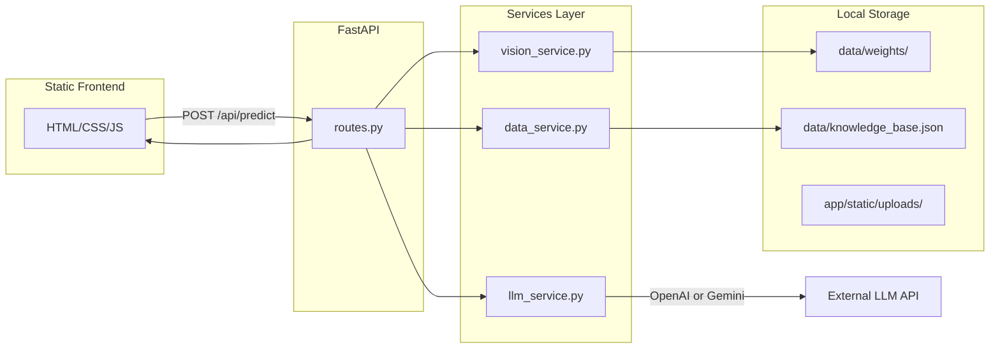
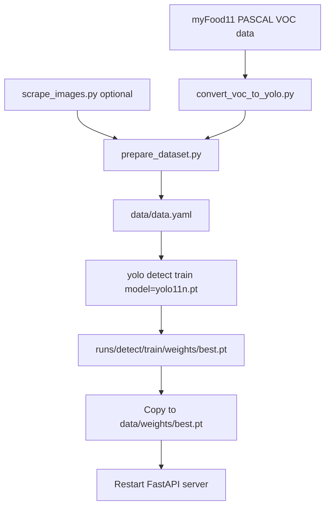

# FoodSense-MY Architecture

## System Overview

FoodSense-MY is a modular FastAPI application that detects Malaysian food dishes in uploaded images and provides nutritional advisory information powered by a local JSON knowledge base and an optional LLM.

## Request Flow

1. User uploads a food image via the web UI.
2. `routes.py` validates the upload and saves it to `app/static/uploads/`.
3. `vision_service.py` preprocesses the image with OpenCV and runs YOLOv11n inference.
4. `data_service.py` looks up each detected class in `data/knowledge_base.json`.
5. `llm_service.py` generates a user-friendly advisory using verified nutrition data (or a template fallback).
6. Structured JSON is returned and rendered in the frontend.

## Module Responsibilities

| Module | File | Responsibility |
|--------|------|----------------|
| Entry point | `app/main.py` | FastAPI app, lifespan, static file mounting, CORS |
| Routes | `app/api/routes.py` | `/api/health`, `/api/predict`, `/api/classes` |
| Config | `app/core/config.py` | Environment variables via pydantic-settings |
| Security | `app/core/security.py` | Upload validation, optional API key check |
| Schemas | `app/models/schemas.py` | Pydantic request/response models |
| Vision | `app/services/vision_service.py` | OpenCV preprocessing, YOLOv11n inference |
| Data | `app/services/data_service.py` | JSON knowledge base loading and lookup |
| LLM | `app/services/llm_service.py` | OpenAI/Gemini advisory generation |
| Frontend | `app/static/` | Upload UI, results display |

## Environment Variables

| Variable | Description | Default |
|----------|-------------|---------|
| `LLM_PROVIDER` | `openai` or `gemini` | `openai` |
| `OPENAI_API_KEY` | OpenAI API key | — |
| `OPENAI_MODEL` | OpenAI model | `gpt-4o-mini` |
| `GEMINI_API_KEY` | Gemini API key | — |
| `GEMINI_MODEL` | Gemini model | `gemini-2.0-flash` |
| `MODEL_WEIGHTS_PATH` | YOLO weights path | `data/weights/best.pt` |
| `KNOWLEDGE_BASE_PATH` | Nutrition JSON path | `data/knowledge_base.json` |
| `CONFIDENCE_THRESHOLD` | Detection threshold | `0.25` |
| `MAX_UPLOAD_SIZE_MB` | Max upload size | `10` |
| `API_KEY_ENABLED` | Require API key | `false` |
| `API_KEY` | API key value | — |

## Training to Deployment Workflow

### Steps

1. **Convert annotations:** `python training_scripts/convert_voc_to_yolo.py --voc-dir ... --images-dir ...`
2. **Scrape images (optional):** `python training_scripts/scrape_images.py --output-dir data/raw_images`
3. **Prepare splits:** `python training_scripts/prepare_dataset.py --source-dir data/yolo_dataset --output-dir data/dataset`
4. **Train:** `yolo detect train model=yolo11n.pt data=data/dataset/data.yaml epochs=100 imgsz=640`
5. **Deploy weights:** `cp runs/detect/train/weights/best.pt data/weights/best.pt`
6. **Run:** `uvicorn app.main:app --reload --host 0.0.0.0 --port 8000`

## LLM Safety Design

- Verified nutrition numbers come exclusively from `knowledge_base.json`.
- The LLM system prompt instructs the model not to invent nutritional values.
- A template-based fallback is used when API keys are missing or LLM calls fail.
- The UI displays a disclaimer that information is not medical advice.

## Development Notes

- Until custom weights are trained, the app falls back to Ultralytics pretrained `yolo11n.pt` (COCO classes).
- Model and knowledge base are loaded once at startup via FastAPI lifespan.
- Uploaded images are stored in `app/static/uploads/` and served at `/uploads/`.
