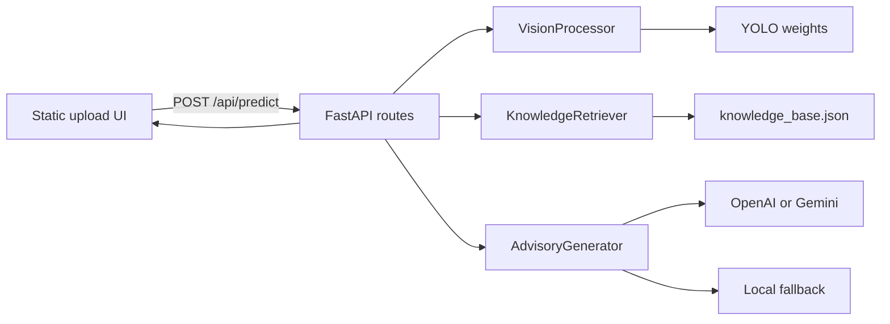
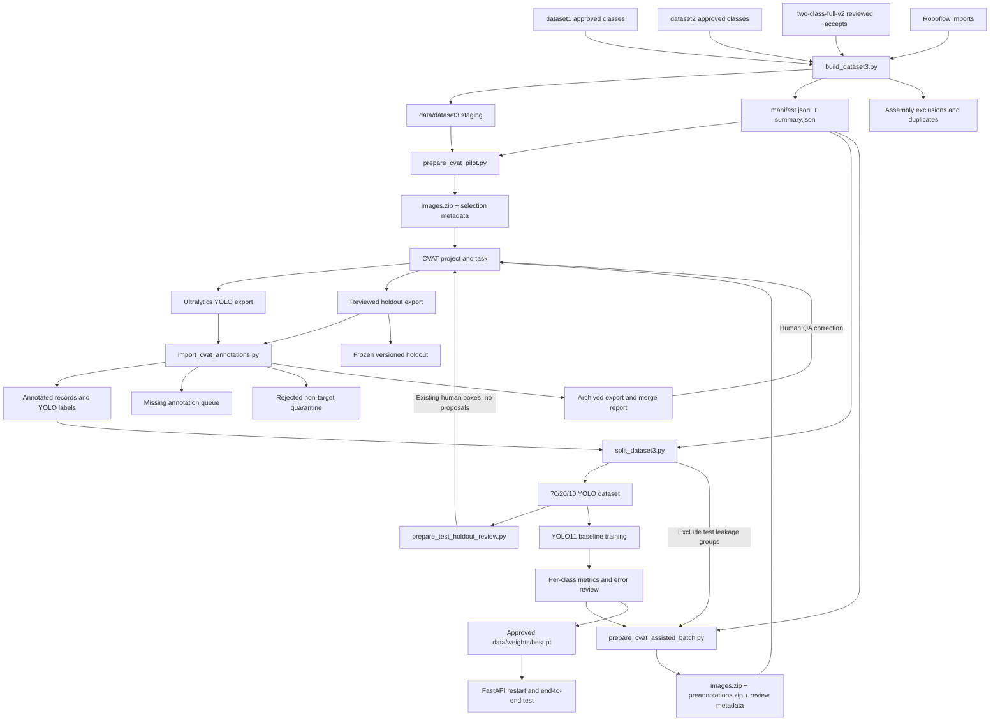

# FoodSense-MY Architecture

## System Overview

FoodSense-MY contains two related systems:

1. a FastAPI application that detects six Malaysian dishes and returns verified nutrition plus an optional LLM-formatted advisory;
2. a local data pipeline that acquires, curates, consolidates, annotates, splits, trains, and promotes the custom detector.

The application is runnable. Dataset consolidation, the first CVAT pilot, its Phase A priority audit, the Phase B leakage-safe split, the Phase C YOLO11n pilot, the reviewed Phase D batch 001–004 merges, the no-proposal test-holdout audit, two locked incremental splits, and two interim HPC retrains (`dataset3_interim_v2` and `dataset3_interim_v3`) are complete. Assisted batch 005 review, further annotation, final evaluation, and production model promotion remain pending.



## Canonical Class Contract

Class IDs are a cross-system contract shared by dataset3 labels, CVAT, Ultralytics training, inference responses, and the nutrition knowledge base.

| ID | Class key | Display name |
|---:|-----------|--------------|
| 0 | `nasi_lemak` | Nasi Lemak |
| 1 | `roti_canai` | Roti Canai |
| 2 | `char_kuey_teow` | Char Kuey Teow |
| 3 | `chicken_rice` | Chicken Rice |
| 4 | `laksa` | Laksa |
| 5 | `mee_goreng` | Mee Goreng |

Never reorder these IDs in CVAT exports or `data.yaml`. Human annotation is authoritative when an image's source folder disagrees with its actual contents.

## Application Request Flow

1. The browser uploads an image.
2. `app/api/routes.py` validates and stores it under `app/static/uploads/`.
3. `VisionProcessor` preprocesses with OpenCV and runs YOLO with the configured confidence and IoU thresholds on MPS or CPU.
4. `KnowledgeRetriever` maps detected canonical classes to verified records in `data/knowledge_base.json`.
5. `AdvisoryGenerator` formats those records through OpenAI, Gemini, or a local template fallback.
6. The response contains boxes, classes, confidence, nutrition, advisory text, processing time, and a mandatory disclaimer.

## Module Responsibilities

### Application modules

| Module | Main class | File | Responsibility |
|--------|------------|------|----------------|
| Entry point | — | `app/main.py` | FastAPI construction, lifespan, CORS, static mounting |
| Routes | — | `app/api/routes.py` | Health, classes, and prediction endpoints with dependency injection |
| Configuration | `Settings` | `app/core/config.py` | Paths, thresholds, device, providers, and canonical classes |
| Security | — | `app/core/security.py` | Upload validation and optional API key |
| Schemas | — | `app/models/schemas.py` | Pydantic request and response contracts |
| Vision | `VisionProcessor` | `app/services/vision_service.py` | OpenCV preprocessing, YOLO inference, and NMS |
| Nutrition | `KnowledgeRetriever` | `app/services/data_service.py` | Local JSON knowledge-base lookup |
| Advisory | `AdvisoryGenerator` | `app/services/llm_service.py` | Formatting-only LLM call and deterministic fallback |
| Frontend | — | `app/static/` | Upload interaction and result rendering |

### Dataset and training modules

| Module | File | Responsibility |
|--------|------|----------------|
| Image acquisition | `training_scripts/scrape_images.py` | Coordinate Google, Bing, or SeleniumBase UC scraping and provenance |
| Google crawler | `training_scripts/google_crawler.py` | Hardened icrawler Google acquisition |
| UC crawler | `training_scripts/uc_crawler.py` | Undetected Chrome acquisition and recovered source URLs |
| Curation CLI | `training_scripts/curate_images.py` | Run pilot or calibrated curation |
| Curation engine | `training_scripts/curation.py` | Technical validation, SHA-256/dHash deduplication, OpenCLIP scoring, calibration, and routed views |
| Roboflow subset import | `training_scripts/import_roboflow_subset.py` | Validate, map, deduplicate, and preserve provenance for a selected Roboflow class |
| Dataset3 builder | `training_scripts/build_dataset3.py` | Merge approved sources, collapse exact duplicates, assign leakage groups, and generate the manifest |
| CVAT batch preparation | `training_scripts/prepare_cvat_pilot.py` | Deterministically sample missing-label images and build an image archive |
| CVAT assisted batch | `training_scripts/prepare_cvat_assisted_batch.py` | Exclude candidate-test and prior-selection groups, apply class quotas, generate pilot-model proposals, and package CVAT artifacts |
| CVAT merge/revision | `training_scripts/import_cvat_annotations.py` | Validate first-time or replacement exports, merge/revise labels, create recoverable backups, and quarantine rejected frames |
| Dataset3 splitting | `training_scripts/split_dataset3.py` | Build a fresh group-stratified split or preserve base train/validation assignments while locking a reviewed holdout; materialize immutable YOLO views and validate hashes and coverage |
| VOC conversion | `training_scripts/convert_voc_to_yolo.py` | Convert reviewed PASCAL VOC annotations to YOLO |
| Legacy splitting | `training_scripts/prepare_dataset.py` | Random flat-folder split; not safe for dataset3 leakage groups |
| Hyperparameter tuning | `training_scripts/tune_yolo.py` | Optuna trials for YOLO |
| Reproducibility | `training_scripts/utils.py` | Fix Python, NumPy, PyTorch, and MPS seeds |

## Dataset and Training Data Flow



## Dataset3 Data Model

`data/dataset3/` is the canonical unsplit staging area. After assisted batch 004 it contains 5,235 usable images, 2,174 annotated images, 2,267 boxes, 3,061 missing annotations, and 72 rejected records.

```text
data/dataset3/
├── <primary-class>/
│   ├── images/<image-id>.<ext>
│   └── labels/<image-id>.txt
├── rejected/
│   └── cvat_pilot_300/<primary-class>/images/
├── manifest.jsonl
├── summary.json
└── README.md
```

The six primary class directories are `nasi_lemak`, `roti_canai`, `char_kuey_teow`, `chicken_rice`, `laksa`, and `mee_goreng`.

Key rules:

- Image IDs are content-derived and stable across materialization.
- One usable image is materialized per exact SHA-256 digest.
- `leakage_group` joins exact or near-duplicate images that must stay in one split.
- `annotation_status` is `annotated`, `missing`, or `rejected`.
- A primary/source class describes provenance, not necessarily every object in the image.
- The YOLO label file is authoritative and may contain multiple classes or instances.
- A rejected non-target image is moved outside the six usable class trees and is not represented by an empty training label.

### Current annotation coverage

| Class | Usable images | Annotated | Boxes | Missing |
|-------|--------------:|----------:|------:|--------:|
| Nasi Lemak | 989 | 323 | 342 | 666 |
| Roti Canai | 981 | 312 | 351 | 669 |
| Char Kuey Teow | 612 | 551 | 561 | 61 |
| Chicken Rice | 708 | 499 | 512 | 209 |
| Laksa | 1,087 | 324 | 334 | 763 |
| Mee Goreng | 858 | 165 | 167 | 693 |

## CVAT Integration Boundary

The repository automates batch preparation and validated result import; CVAT hosts the interactive human review.

Archived pilot identifiers:

- project `FoodSense-MY dataset3`, ID `425516`;
- task `dataset3 bounding-box pilot 300`, ID `2438268`;
- job ID `4258646`;
- 50 initially missing images per source class, seed 42;
- initial merge: 286 labelled images, 299 boxes, and 14 rejected frames;
- Phase A audited revision: 292 labelled images, 307 pilot boxes, and 8 rejected frames.

The hosted pilot task was deleted on 20 July 2026 after the local archive and
revision evidence passed integrity checks. Its identifiers remain provenance,
not active CVAT resources.

```text
data/cvat/pilot-300/
├── images.zip                 # CVAT input package
├── selection.jsonl           # source record for each frame
├── summary.json               # deterministic selection summary
├── cvat-export.zip            # archived Ultralytics YOLO export
├── merge-report.json          # validated merge outcome
├── rejected.jsonl             # rejected frame evidence
├── pre-merge/                 # previous dataset metadata backup
├── cvat-audited-export-v2.zip # corrected Phase A export
└── revisions/phase-a-v2/      # revision report, export, and pre-apply backups
```

Import is a two-stage operation: validation is the default and `--apply` authorizes mutation only after all archive rows, IDs, paths, and coordinates pass. A first merge accepts only `missing` records. A replacement export requires a unique `--revision-id`; its semantic comparison ignores row-order-only changes, backs up metadata and replaced labels, and can restore, reject, relabel, or update boxes without destroying the original merge evidence. Rejected frames are moved recoverably into the dataset3 quarantine.

The annotation contract is documented in [`bounding-box-policy.md`](bounding-box-policy.md).

Phase D batch 001 is local at `data/cvat/assisted-batch-001/`. It contains 300
unique leakage groups, excludes all 83 current candidate-test groups and all
prior CVAT selections, and has 338 predictions on 299 images at confidence
0.20. `images.zip` is the task input; `preannotations.zip` is a structurally
validated Ultralytics YOLO Detection annotation import. `predictions.jsonl`
retains confidence and review-priority metadata that YOLO annotation rows do
not carry. Empty proposals remain undecided until a human either adds boxes or
confirms rejection.

Former CVAT task `2439970` and completed job `4260450` materialized the
300-image batch; the hosted task was deleted after local archive validation.
Human review accepted 309 boxes on 293 images, rejected 7 non-target frames, and made
30 primary noodle-class corrections. The reviewed export SHA-256 is
`808152b054ccc3b921c9dc07aa1d991d88d2a7549dcff0a678f39291ce6e4aa6`.
Dry validation passed and the merge created `pre-merge/`, `merge-report.json`,
and recoverable rejected-image evidence before updating dataset3.

Phase D batch 002 is staged at `data/cvat/assisted-batch-002/`. Seed 44 selected
300 missing-label records from 300 distinct leakage groups using the same
60/60/60/40/40/40 source-class quotas. The selector excluded all 83 current
candidate-test groups and all 600 groups selected by the original pilot and
batch 001. The pilot model proposed 326 boxes on 296 images at confidence 0.20;
231 frames are marked high priority in `predictions.jsonl`. Both ZIP archives
pass structural validation. Former CVAT task `2441400` and completed job
`4261934` contained all 300 images; the hosted task was deleted after local
archive validation. Human review accepted 304 rectangles on 287 images,
rejected 13 non-target frames, retained two multi-class images, and made 36
primary-class corrections. The reviewed export SHA-256 is
`05c841a65aac8477d7cefadcf516718989fbc37b4b95eac0be1cb2faedff75fa`.
Dry validation passed and the guarded merge created the archived export,
`pre-merge/`, `merge-report.json`, and recoverable rejection evidence.

Phase D batch 003 is local at `data/cvat/assisted-batch-003/`. Seed 45 selected
300 missing-label records from 300 distinct leakage groups using the same
60/60/60/40/40/40 source-class quotas and the interim v2 checkpoint. The
selector excluded all 81 locked test groups and all 951 groups selected by the
original pilot plus batches 001 and 002. The model proposed 342 boxes on 298
images at confidence 0.20; 213 frames are marked high priority in
`predictions.jsonl`. Both ZIP archives pass structural validation. CVAT task
`2441914` and completed job `4262530` contained all 300 images. Human review
accepted 304 rectangles on 289 images, rejected 11 non-target frames, retained
one multi-class image, and made 30 primary-class corrections, including 26
`mee_goreng` → `char_kuey_teow`. The reviewed export SHA-256 is
`5df6061b5d34beb971aacb05d53dad5b564372e25c7ada6461885b0ea2ec9c2b`.
Dry validation passed and the guarded merge created the archived export,
`pre-merge/`, `merge-report.json`, and recoverable rejection evidence.

Phase D batch 004 is local at `data/cvat/assisted-batch-004/`. Seed 46 selected
500 missing-label records from 500 distinct leakage groups using
100/100/100/67/67/66 source-class quotas and the interim v2 checkpoint. The selector
excluded all 81 locked test groups and 1,251 prior selection groups. The model
proposed 589 boxes on 494 images at confidence 0.20; 390 frames are high
priority and six had no proposal. CVAT task `2442189` and completed job
`4262800` contained all 500 images. Human review accepted 497 rectangles on
469 images, rejected 31 non-target frames, retained three multi-class images,
and made 61 primary-class corrections, including 51 `mee_goreng` →
`char_kuey_teow`. The reviewed export SHA-256 is
`306ef725a76302af8d64be9048d11d7b3062fff976dd9cd51152cf4c5383bd64`.
Dry validation passed and the guarded merge created the archived export,
`pre-merge/`, `merge-report.json`, and recoverable rejection evidence.

Phase D batch 005 is staged at `data/cvat/assisted-batch-005/`. Seed 47 selected
300 missing-label records from 300 distinct leakage groups using 60/60/60/40/40/40
source-class quotas and the interim v3 checkpoint. The selector excluded all 81
locked test groups and 1,751 prior selection groups. The model proposed 358
boxes on 299 images at confidence 0.20; 239 frames are high priority and one has
no proposal. Only four Mee Goreng boxes were proposed, reflecting the interim v3
recall gap, so reviewers must add missing Mee Goreng instances manually. Both ZIP
archives pass integrity checks and the embedded class mapping is canonical. Human
review and guarded import remain pending.

`training_scripts/prepare_test_holdout_review.py` is the boundary between the
immutable Phase B candidate set and manual holdout verification. It requires an
exact match between the test split and pending review queue, resolves every SHA
against the current Dataset3 manifest, verifies image and baseline label
digests, validates every YOLO row and box count, and refuses to overwrite an
existing output. Its `data/cvat/test-holdout-review-v1/` output contains 84
images, 86 existing human boxes, 83 leakage groups, and zero model proposals.
`images.zip` creates the CVAT task; `current-annotations.zip` imports the
existing labels; `selection.jsonl` is the contract for a later revision-safe
import; and `cvat-task.json` records the active task/job IDs and imported class
totals.

CVAT project `425516` hosts holdout task `2441672`, completed job `4262178`.
All 84 frames and 86 existing rectangles were imported successfully, with
CVAT's initial per-class statistics matching the package summary. Human review
retained 82 images with 84 boxes, rejected two non-target frames, adjusted 52
other boxes, and corrected one `mee_goreng` primary class to
`char_kuey_teow`. Revision `test-holdout-v1` passed dry validation and was
applied with a recoverable backup. The Phase B baseline remains immutable; a
new versioned split must lock the accepted reviewed groups into test.

Human collaborators follow
[`cvat-collaborator-guide.md`](cvat-collaborator-guide.md). It defines package
roles, task creation, the fixed class mapping, Ultralytics YOLO import/export,
per-frame review, reviewer handoff, owner-side validation, and safe hosted-task
rotation.

## Leakage-Safe Split Architecture

The current `training_scripts/prepare_dataset.py` must not be used unchanged for dataset3. It expects a flat input layout, performs a file-level random split, does not filter by manifest status, and does not preserve leakage groups.

`training_scripts/split_dataset3.py` implements the replacement. It:

1. loads `manifest.jsonl` and selects only usable `annotated` records;
2. allocates entire `leakage_group` values to train, validation, or test;
3. targets 70/20/10 ratios using exact primary-class image targets and object-count refinement;
4. uses stable seed 42 and writes a content-hashed immutable split manifest;
5. hard-links images but copies labels so later annotation changes cannot mutate the frozen baseline;
6. generates `data.yaml` with the fixed six-class ID order;
7. fails validation on changed source/manifests, digest mismatches, cross-split leakage, invalid labels, missing pairs, or absent evaluation classes;
8. refuses to overwrite an existing output and creates a pending test-review queue.

Its locked incremental mode additionally requires both a base split manifest and
a reviewed selection. The selection must exactly cover the base test split.
Current `annotated` selection records and every member of their leakage groups
are forced into test, current `rejected` selection records are excluded,
surviving base train/validation groups retain their assignments, and only new
groups may be balanced between train and validation. The generated queue uses
`accepted` rather than `pending`, and the summary records both input hashes and
locked-group counts.

The generated `data/dataset3-baseline/` contains only the 838 annotated usable images:

| Split | Images | Leakage groups | Boxes |
|-------|-------:|---------------:|------:|
| Train | 587 | 584 | 598 |
| Validation | 167 | 167 | 171 |
| Test candidate | 84 | 83 | 86 |

Its split-manifest SHA-256 is `f87d6f4ab07e463ddca111c4add9c5a6236acf4d08e0c0500b8802f1e45e7d1e`. Validation reports zero cross-split leakage groups and zero missing pairs, with all six object classes represented in validation and test. The immutable `test-review-queue.jsonl` still records the original 84 candidates as pending, but their external audit is complete and applied to Dataset3.

Phase D assisted batches changed the canonical dataset3 manifest after this baseline
was created. The baseline remains a valid immutable experiment snapshot, but
source-hash validation against current dataset3 now intentionally detects that
divergence. A subsequent split must use a new versioned output directory.

The generated `data/dataset3-interim-v2/` locks the reviewed outcome:

| Split | Images | Leakage groups | Boxes |
|-------|-------:|---------------:|------:|
| Train | 1,067 | 1,064 | 1,106 |
| Validation | 267 | 267 | 276 |
| Reviewed test | 82 | 81 | 84 |

All 754 surviving Phase B train/validation images retain their original split,
all 580 later batch annotations are train/validation-only, and the test IDs
exactly equal the 82 accepted holdout IDs. Its split-manifest SHA-256 is
`8e9db98b57dd53f01778afe8d1b66bc4e07975f639356c9758226102eecd90dd`.
The test queue contains 82 `accepted` entries and no pending entries.

The final production split should be regenerated from a more fully annotated manifest while preserving the manually verified holdout groups.

The holdout lifecycle is:

```text
immutable Phase B test manifest + pending queue
    → integrity-checked no-proposal CVAT package
    → manual verification of every existing box and frame
    → reviewed Ultralytics YOLO export
    → dry-run semantic revision report
    → versioned Dataset3 revision with recovery backup
    → new leakage-safe split preserving reviewed groups [completed: dataset3-interim-v2, dataset3-interim-v3]
    → frozen holdout evaluation
```

## Model Lifecycle

```text
yolo11n.pt pretrained initialization
    → pilot baseline experiment [completed: dataset3_pilot_v1]
    → per-class metrics and qualitative QA [completed]
    → CVAT assisted-labelling proposals [batches 001–004 completed]
    → human correction and validated batch merge [batches 001–004 completed]
    → no-proposal holdout verification [task 2441672; completed and applied]
    → locked reviewed holdout in a new leakage-safe split [completed]
    → interim HPC retraining v2 [completed: dataset3_interim_v2]
    → locked incremental split + interim HPC retraining v3 [completed: dataset3_interim_v3]
    → assisted batch 005 proposals [prepared]
    → assisted batch 005 human review and guarded merge [pending]
    → final training and threshold calibration after annotation freeze
    → versioned candidate weights
    → accepted data/weights/best.pt
    → FastAPI restart and smoke test
```

Model promotion is deliberate. Training outputs must first be saved under a versioned candidate name. `data/weights/best.pt` represents the application-approved detector, not merely the most recent experiment.

The current assisted-labelling artifact is
`runs/detect/dataset3_interim_v3/weights/best.pt`. It was fine-tuned from the
interim v2 checkpoint on the expanded `dataset3-interim-v3` split and selected
epoch 1 with validation mAP50 0.932 and mAP50–95 0.761. It is not
production-approved: 3,061 images remain unannotated, Mee Goreng recall dropped
to 0.513, noodle-class confusion and Chicken Rice localization still need
targeted review, and the locked test set must stay unevaluated until final model
selection. The epoch-1 peak indicates the fine-tuning learning rate should be
lowered for the next retrain. See
[`experiments/dataset3_interim_v2.md`](experiments/dataset3_interim_v2.md) and
[`experiments/dataset3_interim_v3.md`](experiments/dataset3_interim_v3.md) for
the complete evaluations.

## Repository Structure

```text
FoodSense-MY/
├── app/
│   ├── main.py
│   ├── api/routes.py
│   ├── core/config.py, security.py
│   ├── models/schemas.py
│   ├── services/vision_service.py, data_service.py, llm_service.py
│   └── static/
├── data/                               # Mostly gitignored local state
│   ├── knowledge_base.json
│   ├── dataset1/, dataset2/
│   ├── scraped_raw/
│   ├── curation/runs/
│   ├── external/roboflow/              # Validated Roboflow source imports
│   ├── dataset3/                       # Canonical unsplit staging dataset
│   ├── cvat/pilot-300/                 # Pilot input, export, and audit artifacts
│   ├── cvat/assisted-batch-001/         # Phase D input, proposals, and review metadata
│   ├── cvat/assisted-batch-002/         # Reviewed export and recovery metadata
│   ├── cvat/assisted-batch-003/         # Interim-v2 proposals, reviewed export, merge report
│   ├── cvat/assisted-batch-004/         # 500-image reviewed export and merge report
│   ├── cvat/assisted-batch-005/         # Interim-v3 proposal package; review pending
│   ├── cvat/test-holdout-review-v1/      # No-proposal candidate-test verification package
│   ├── dataset3-baseline/              # Generated leakage-safe pilot split
│   ├── dataset3-interim-v2/            # Locked holdout + expanded train/validation
│   ├── dataset3-interim-v3/            # Interim-v3 locked split (1,674/418/82)
│   └── weights/                        # Approved custom best.pt; pending
├── runs/detect/dataset3_pilot_v1/      # Phase C pilot artifacts; not production-promoted
├── runs/detect/dataset3_interim_v2/    # HPC interim v2 artifacts
├── runs/detect/dataset3_interim_v3/    # HPC interim v3 artifacts; batch-005 proposal model
├── training_scripts/
│   ├── scrape_images.py, google_crawler.py, uc_crawler.py
│   ├── curate_images.py, curation.py
│   ├── import_roboflow_subset.py
│   ├── build_dataset3.py
│   ├── prepare_cvat_pilot.py
│   ├── prepare_cvat_assisted_batch.py
│   ├── prepare_test_holdout_review.py
│   ├── import_cvat_annotations.py
│   ├── split_dataset3.py
│   ├── convert_voc_to_yolo.py
│   ├── prepare_dataset.py
│   ├── tune_yolo.py
│   └── utils.py
├── tests/
├── docs/architecture.md, handoff.md, bounding-box-policy.md
├── docs/cvat-collaborator-guide.md    # Group-member upload/review/export procedure
├── docs/experiments/dataset3_pilot_v1.md
├── docs/experiments/dataset3_interim_v2.md
├── requirements.txt                 # Default / macOS MPS install
├── requirements-hpc.txt             # NVIDIA CUDA 12.4 index for HPC GPUs
└── .env.example
```

## PyTorch / CUDA Install Boundary

- Local macOS development installs [`requirements.txt`](../requirements.txt) and uses MPS when available.
- HPC NVIDIA training should install [`requirements-hpc.txt`](../requirements-hpc.txt), which selects CUDA 12.4 wheels via `--extra-index-url https://download.pytorch.org/whl/cu124`.
- Observed failure mode on CUDA 12.8 drivers (API `12080`): installing a newer CUDA torch wheel raises `RuntimeError: The NVIDIA driver on your system is too old (found version 12080)`. Prefer `cu124` (or `cu126` if `cu124` is unavailable) rather than the newest CUDA index.
- Ultralytics training on HPC must use `device=0` (or another CUDA device id), not `device=mps`.
- `data/dataset3-interim-v2/data.yaml` embeds an absolute `path:`; rewrite it for the cluster. Its images are hardlinks into `data/dataset3/`, so transfers must dereference (`rsync -aL`) unless the full staging tree is copied and the split is regenerated on the cluster.

## Environment Variables

| Variable | Description | Default |
|----------|-------------|---------|
| `LLM_PROVIDER` | `openai` or `gemini` | `openai` |
| `OPENAI_API_KEY` | Optional OpenAI key | — |
| `OPENAI_MODEL` | OpenAI advisory model | `gpt-4o-mini` |
| `GEMINI_API_KEY` | Optional Gemini key | — |
| `GEMINI_MODEL` | Gemini advisory model | `gemini-2.0-flash` |
| `MODEL_WEIGHTS_PATH` | Application YOLO weights | `data/weights/best.pt` |
| `KNOWLEDGE_BASE_PATH` | Verified nutrition JSON | `data/knowledge_base.json` |
| `CONFIDENCE_THRESHOLD` | Inference confidence threshold | `0.5` |
| `IOU_THRESHOLD` | Inference IoU threshold | `0.45` |
| `DEVICE` | `auto`, `mps`, `cuda`, or `cpu` | `auto` |
| `MAX_UPLOAD_SIZE_MB` | Upload size limit | `10` |
| `API_KEY_ENABLED` | Require an API key | `false` |
| `API_KEY` | Optional API key value | — |

## Safety and Reproducibility

- Nutrition values originate only from `data/knowledge_base.json`; the LLM is a formatting layer.
- A fixed disclaimer is always returned by the API.
- Raw acquisition inputs and CVAT exports are retained as provenance.
- Exact hashes and near-duplicate groups prevent avoidable split leakage.
- Batch imports validate before mutation and back up dataset metadata.
- Fixed seeds are used for selection and future splits, but MPS training may still have nondeterministic kernels.
- Empty/non-target images are quarantined rather than silently treated as background training samples.

See [`handoff.md`](handoff.md) for live counts, completed milestone evidence, and the staged next-step plan.
