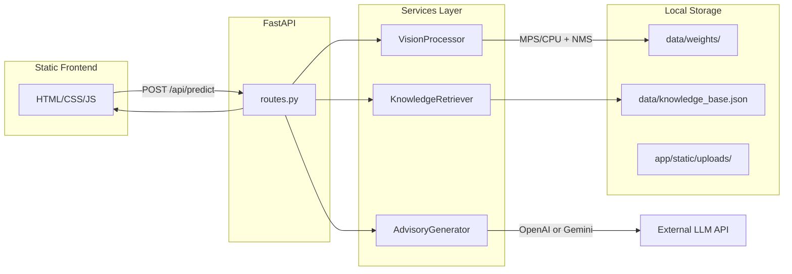
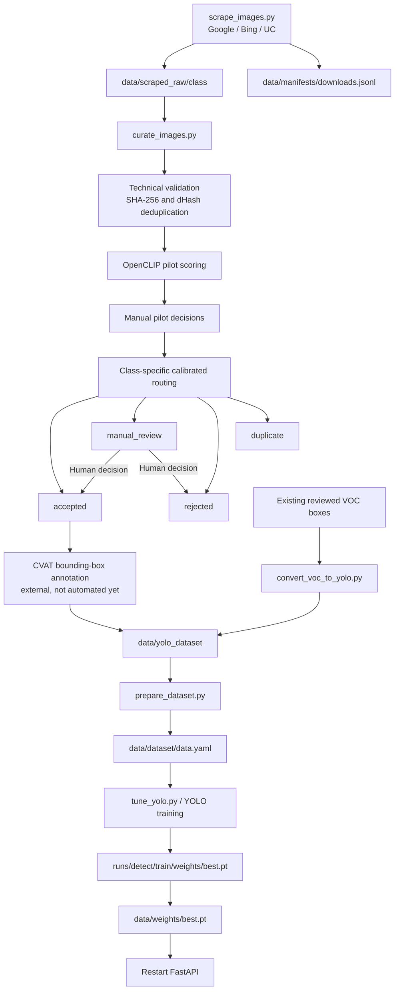

# FoodSense-MY Architecture

## System Overview

FoodSense-MY is a modular FastAPI application that detects 6 Malaysian food dishes in uploaded images and provides nutritional advisory information powered by a local JSON knowledge base and an optional LLM (formatting layer only). The repository also contains the acquisition, curation, annotation-conversion, dataset-preparation, tuning, and training utilities used to produce the custom detector.



## Target Classes (6)

| Class Key | Display Name |
|-----------|-------------|
| `nasi_lemak` | Nasi Lemak |
| `roti_canai` | Roti Canai |
| `char_kuey_teow` | Char Kuey Teow |
| `chicken_rice` | Chicken Rice |
| `laksa` | Laksa |
| `mee_goreng` | Mee Goreng |

## Request Flow

1. User uploads a food image via the web UI.
2. `routes.py` validates the upload and saves it to `app/static/uploads/`.
3. `VisionProcessor` preprocesses with OpenCV, runs YOLOv11n on MPS/CPU with explicit NMS (`conf=0.5`, `iou=0.45`).
4. `KnowledgeRetriever` looks up each detected class in `data/knowledge_base.json`.
5. `AdvisoryGenerator` formats verified JSON data via LLM (or template fallback).
6. Response includes detections, nutrition, advisory text, and a mandatory disclaimer.

## Module Responsibilities

| Module | Class | File | Responsibility |
|--------|-------|------|----------------|
| Entry point | — | `app/main.py` | FastAPI app, lifespan, static file mounting, CORS |
| Routes | — | `app/api/routes.py` | `/api/health`, `/api/predict`, `/api/classes` with DI |
| Config | `Settings` | `app/core/config.py` | Environment variables, TARGET_CLASSES |
| Security | — | `app/core/security.py` | Upload validation, optional API key check |
| Schemas | — | `app/models/schemas.py` | Pydantic request/response models |
| Vision | `VisionProcessor` | `app/services/vision_service.py` | OpenCV preprocessing, YOLOv11n + NMS on MPS/CPU |
| Data | `KnowledgeRetriever` | `app/services/data_service.py` | JSON knowledge base loading and lookup |
| LLM | `AdvisoryGenerator` | `app/services/llm_service.py` | LLM as formatting-only layer |
| Frontend | — | `app/static/` | Upload UI, results display |

### Dataset and training modules

| Module | Main class/function | File | Responsibility |
|--------|---------------------|------|----------------|
| Scraping CLI | `ImageScraper` | `training_scripts/scrape_images.py` | Coordinates Google, Bing, or UC scraping for selected classes and appends provenance |
| Google crawler | `GoogleImageCrawler` wrapper | `training_scripts/google_crawler.py` | Hardened icrawler-based Google acquisition |
| UC crawler | UC scraping helpers | `training_scripts/uc_crawler.py` | SeleniumBase Undetected Chrome acquisition, query logs, and recovered source URLs |
| Curation CLI | `main` | `training_scripts/curate_images.py` | Loads configuration and runs pilot or calibrated curation |
| Curation engine | `ImageCurator` | `training_scripts/curation.py` | Validation, SHA-256/dHash deduplication, OpenCLIP scoring, calibration, manifests, and routed views |
| Curation policy | — | `training_scripts/configs/curation.yaml` | Class prompts and technical, deduplication, and semantic thresholds |
| Annotation conversion | `VocToYoloConverter` | `training_scripts/convert_voc_to_yolo.py` | Converts reviewed PASCAL VOC boxes to YOLO labels |
| Dataset preparation | `DatasetPreparer` | `training_scripts/prepare_dataset.py` | Produces train/validation/test folders and `data.yaml` |
| Hyperparameter tuning | `YoloHyperparameterTuner` | `training_scripts/tune_yolo.py` | Runs Optuna trials for YOLOv11n |
| Reproducibility | `ReproducibilityManager` | `training_scripts/utils.py` | Fixes Python, NumPy, PyTorch, and MPS seeds |

## Environment Variables

| Variable | Description | Default |
|----------|-------------|---------|
| `LLM_PROVIDER` | `openai` or `gemini` | `openai` |
| `OPENAI_API_KEY` | OpenAI API key | — |
| `OPENAI_MODEL` | OpenAI model | `gpt-4o-mini` |
| `GEMINI_API_KEY` | Gemini API key | — |
| `GEMINI_MODEL` | Gemini model | `gemini-2.0-flash` |
| `MODEL_WEIGHTS_PATH` | YOLO weights path | `data/weights/best.pt` |
| `KNOWLEDGE_BASE_PATH` | Nutrition JSON path | `data/knowledge_base.json` |
| `CONFIDENCE_THRESHOLD` | NMS confidence threshold | `0.5` |
| `IOU_THRESHOLD` | NMS IoU threshold | `0.45` |
| `DEVICE` | Compute device (`auto`, `mps`, `cpu`) | `auto` |
| `MAX_UPLOAD_SIZE_MB` | Max upload size | `10` |
| `API_KEY_ENABLED` | Require API key | `false` |
| `API_KEY` | API key value | — |

## Dataset, Training, and Deployment Workflow



### Acquisition and curation

The implemented two-class acquisition defaults to `char_kuey_teow` and `chicken_rice`. Raw source files are immutable inputs; curation creates run-scoped hard-linked views instead of modifying them.

```bash
python training_scripts/scrape_images.py \
  --output-dir data/scraped_raw \
  --classes char_kuey_teow chicken_rice \
  --max-images 1500 \
  --engine uc \
  --google-fallback
```

New downloads append records to `data/manifests/downloads.jsonl` by default. A provenance record may include the requested class, search query, engine, URL, hash, dimensions, and local path; URL availability depends on the crawler engine.

Create a small pilot, manually move every pilot image into its run's matching `accepted/<class>/` or `rejected/<class>/` folder, and then use that completed run for calibrated routing:

```bash
python training_scripts/curate_images.py \
  --input-dir data/scraped_raw \
  --output-dir data/curation \
  --run-id two-class-pilot-new \
  --limit-per-class 100

python training_scripts/curate_images.py \
  --input-dir data/scraped_raw \
  --output-dir data/curation \
  --run-id two-class-full-new \
  --decisions-from data/curation/runs/two-class-pilot-new \
  --target-precision 0.98
```

Calibrated mode auto-accepts only when the pilot's out-of-fold precision target supports a class-specific threshold. It does not semantically auto-reject new valid images: uncertain candidates go to the single `manual_review/` queue. Technical failures go to `rejected/`, while exact or near-duplicates go to `duplicate/`.

Every run contains the routed folders, `curation.jsonl`, and `summary.json`. A calibrated
run created with `--decisions-from` additionally contains `manual_decisions.jsonl` and
`calibration.json`:

```text
data/curation/runs/<run-id>/
├── accepted/<class>/
├── manual_review/<class>/
├── rejected/<class>/
├── duplicate/<class>/
├── curation.jsonl
├── summary.json
├── manual_decisions.jsonl              # calibrated runs only
└── calibration.json                    # calibrated runs only
```

Folder moves made during review do not rewrite the immutable `curation.jsonl`. Supplying the completed run through `--decisions-from` imports its current accepted/rejected folder state as authoritative manual decisions.

### Annotation through deployment

1. Import accepted images into CVAT and create or correct real bounding boxes for every visible target dish. CVAT task creation and export are not automated in this repository.
2. Export Ultralytics YOLO Detection directly, or convert reviewed VOC XML with `python training_scripts/convert_voc_to_yolo.py --voc-dir ... --images-dir ... --output-dir data/yolo_dataset`.
3. Validate image/label pairing, canonical class IDs, normalized box bounds, and duplicate grouping before splitting. A final export validator is not implemented yet.
4. Prepare splits with `python training_scripts/prepare_dataset.py --source-dir data/yolo_dataset --output-dir data/dataset`. This script currently retains pre-existing output, so clean or version the output directory before rerunning with different sources or seeds.
5. Tune with `python training_scripts/tune_yolo.py --data data/dataset/data.yaml --n-trials 20`.
6. Train with `yolo detect train model=yolo11n.pt data=data/dataset/data.yaml epochs=100 imgsz=640`.
7. Deploy with `cp runs/detect/train/weights/best.pt data/weights/best.pt`.
8. Restart with `uvicorn app.main:app --reload --host 0.0.0.0 --port 8000`.

## Repository Structure

```text
FoodSense-MY/
├── app/
│   ├── main.py
│   ├── api/routes.py
│   ├── core/config.py, security.py
│   ├── models/schemas.py
│   ├── services/vision_service.py, data_service.py, llm_service.py
│   └── static/                         # HTML/CSS/JS and runtime uploads
├── data/                               # Mostly gitignored runtime/dataset state
│   ├── knowledge_base.json
│   ├── dataset1/, dataset2/, dataset3/
│   ├── scraped_raw/                    # Immutable scraped candidates
│   ├── manifests/downloads.jsonl       # Acquisition provenance
│   ├── curation/runs/                  # Run-scoped routed views and manifests
│   ├── yolo_dataset/                   # Reviewed YOLO images/labels; pending
│   ├── dataset/                        # Prepared splits/data.yaml; pending
│   └── weights/                        # Custom best.pt; pending
├── training_scripts/
│   ├── scrape_images.py, google_crawler.py, uc_crawler.py
│   ├── curate_images.py, curation.py
│   ├── configs/curation.yaml
│   ├── convert_voc_to_yolo.py, prepare_dataset.py, tune_yolo.py
│   └── utils.py
├── tests/test_curation.py
├── docs/architecture.md, handoff.md
├── requirements.txt
├── .env.example
└── README.md
```

`docs/handoff.md` is the source for current local dataset counts and run status; this document describes the stable system boundaries and workflow.

## LLM Safety Design

- Verified nutrition numbers come exclusively from `knowledge_base.json`.
- The LLM acts as a **text-formatting layer only** — it must not invent calories, macros, ingredients, or medical advice.
- A fixed `DISCLAIMER` string is always returned server-side in the JSON response.
- A template-based fallback is used when API keys are missing or LLM calls fail.

## PyTorch / MPS Notes

- On Apple Silicon Macs, `VisionProcessor` auto-selects `mps` device for YOLOv11n inference.
- Falls back to `cpu` when MPS is unavailable.
- Override with `DEVICE=mps` or `DEVICE=cpu` in `.env`.
- `ReproducibilityManager` in `training_scripts/utils.py` fixes seeds across random, numpy, and torch (including MPS).

## Development Notes

- Until custom weights are trained, the app falls back to Ultralytics pretrained `yolo11n.pt` (COCO classes).
- Model and knowledge base are loaded once at startup via FastAPI lifespan.
- Uploaded images are stored in `app/static/uploads/` and served at `/uploads/`.
