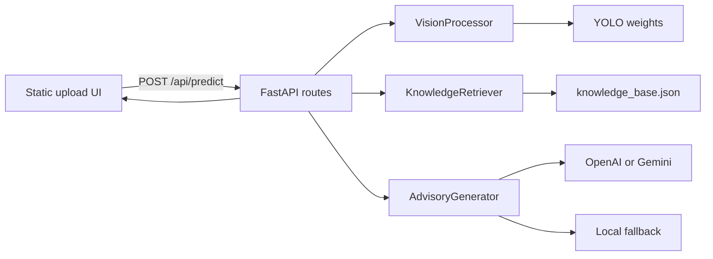
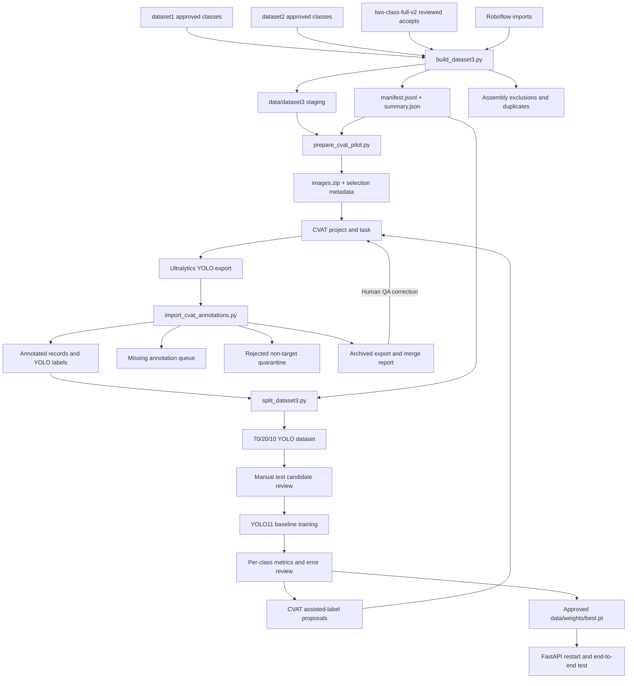

# FoodSense-MY Architecture

## System Overview

FoodSense-MY contains two related systems:

1. a FastAPI application that detects six Malaysian dishes and returns verified nutrition plus an optional LLM-formatted advisory;
2. a local data pipeline that acquires, curates, consolidates, annotates, splits, trains, and promotes the custom detector.

The application is runnable. Dataset consolidation, the first CVAT pilot, its Phase A priority audit, and the Phase B leakage-safe baseline split are complete. Manual test-holdout review, custom training, and model promotion remain pending.



## Canonical Class Contract

Class IDs are a cross-system contract shared by dataset3 labels, CVAT, Ultralytics training, inference responses, and the nutrition knowledge base.

| ID | Class key | Display name |
|---:|-----------|--------------|
| 0 | `nasi_lemak` | Nasi Lemak |
| 1 | `roti_canai` | Roti Canai |
| 2 | `char_kuey_teow` | Char Kuey Teow |
| 3 | `chicken_rice` | Chicken Rice |
| 4 | `laksa` | Laksa |
| 5 | `mee_goreng` | Mee Goreng |

Never reorder these IDs in CVAT exports or `data.yaml`. Human annotation is authoritative when an image's source folder disagrees with its actual contents.

## Application Request Flow

1. The browser uploads an image.
2. `app/api/routes.py` validates and stores it under `app/static/uploads/`.
3. `VisionProcessor` preprocesses with OpenCV and runs YOLO with the configured confidence and IoU thresholds on MPS or CPU.
4. `KnowledgeRetriever` maps detected canonical classes to verified records in `data/knowledge_base.json`.
5. `AdvisoryGenerator` formats those records through OpenAI, Gemini, or a local template fallback.
6. The response contains boxes, classes, confidence, nutrition, advisory text, processing time, and a mandatory disclaimer.

## Module Responsibilities

### Application modules

| Module | Main class | File | Responsibility |
|--------|------------|------|----------------|
| Entry point | — | `app/main.py` | FastAPI construction, lifespan, CORS, static mounting |
| Routes | — | `app/api/routes.py` | Health, classes, and prediction endpoints with dependency injection |
| Configuration | `Settings` | `app/core/config.py` | Paths, thresholds, device, providers, and canonical classes |
| Security | — | `app/core/security.py` | Upload validation and optional API key |
| Schemas | — | `app/models/schemas.py` | Pydantic request and response contracts |
| Vision | `VisionProcessor` | `app/services/vision_service.py` | OpenCV preprocessing, YOLO inference, and NMS |
| Nutrition | `KnowledgeRetriever` | `app/services/data_service.py` | Local JSON knowledge-base lookup |
| Advisory | `AdvisoryGenerator` | `app/services/llm_service.py` | Formatting-only LLM call and deterministic fallback |
| Frontend | — | `app/static/` | Upload interaction and result rendering |

### Dataset and training modules

| Module | File | Responsibility |
|--------|------|----------------|
| Image acquisition | `training_scripts/scrape_images.py` | Coordinate Google, Bing, or SeleniumBase UC scraping and provenance |
| Google crawler | `training_scripts/google_crawler.py` | Hardened icrawler Google acquisition |
| UC crawler | `training_scripts/uc_crawler.py` | Undetected Chrome acquisition and recovered source URLs |
| Curation CLI | `training_scripts/curate_images.py` | Run pilot or calibrated curation |
| Curation engine | `training_scripts/curation.py` | Technical validation, SHA-256/dHash deduplication, OpenCLIP scoring, calibration, and routed views |
| Roboflow subset import | `training_scripts/import_roboflow_subset.py` | Validate, map, deduplicate, and preserve provenance for a selected Roboflow class |
| Dataset3 builder | `training_scripts/build_dataset3.py` | Merge approved sources, collapse exact duplicates, assign leakage groups, and generate the manifest |
| CVAT batch preparation | `training_scripts/prepare_cvat_pilot.py` | Deterministically sample missing-label images and build an image archive |
| CVAT merge/revision | `training_scripts/import_cvat_annotations.py` | Validate first-time or replacement exports, merge/revise labels, create recoverable backups, and quarantine rejected frames |
| Dataset3 splitting | `training_scripts/split_dataset3.py` | Select annotated records, stratify whole leakage groups, materialize an immutable YOLO view, and validate hashes and coverage |
| VOC conversion | `training_scripts/convert_voc_to_yolo.py` | Convert reviewed PASCAL VOC annotations to YOLO |
| Legacy splitting | `training_scripts/prepare_dataset.py` | Random flat-folder split; not safe for dataset3 leakage groups |
| Hyperparameter tuning | `training_scripts/tune_yolo.py` | Optuna trials for YOLO |
| Reproducibility | `training_scripts/utils.py` | Fix Python, NumPy, PyTorch, and MPS seeds |

## Dataset and Training Data Flow



## Dataset3 Data Model

`data/dataset3/` is the canonical unsplit staging area. After the Phase A audited revision it contains 5,299 usable images, 838 annotated images, 855 boxes, 4,461 missing annotations, and 8 rejected pilot records.

```text
data/dataset3/
├── <primary-class>/
│   ├── images/<image-id>.<ext>
│   └── labels/<image-id>.txt
├── rejected/
│   └── cvat_pilot_300/<primary-class>/images/
├── manifest.jsonl
├── summary.json
└── README.md
```

The six primary class directories are `nasi_lemak`, `roti_canai`, `char_kuey_teow`, `chicken_rice`, `laksa`, and `mee_goreng`.

Key rules:

- Image IDs are content-derived and stable across materialization.
- One usable image is materialized per exact SHA-256 digest.
- `leakage_group` joins exact or near-duplicate images that must stay in one split.
- `annotation_status` is `annotated`, `missing`, or `rejected`.
- A primary/source class describes provenance, not necessarily every object in the image.
- The YOLO label file is authoritative and may contain multiple classes or instances.
- A rejected non-target image is moved outside the six usable class trees and is not represented by an empty training label.

### Current annotation coverage

| Class | Usable images | Annotated | Boxes | Missing |
|-------|--------------:|----------:|------:|--------:|
| Nasi Lemak | 996 | 50 | 51 | 946 |
| Roti Canai | 995 | 46 | 55 | 949 |
| Char Kuey Teow | 493 | 152 | 153 | 341 |
| Chicken Rice | 709 | 313 | 316 | 396 |
| Laksa | 1,100 | 150 | 151 | 950 |
| Mee Goreng | 1,006 | 127 | 129 | 879 |

## CVAT Integration Boundary

The repository automates batch preparation and validated result import; CVAT hosts the interactive human review.

Current pilot:

- project `FoodSense-MY dataset3`, ID `425516`;
- task `dataset3 bounding-box pilot 300`, ID `2438268`;
- job ID `4258646`;
- 50 initially missing images per source class, seed 42;
- initial merge: 286 labelled images, 299 boxes, and 14 rejected frames;
- Phase A audited revision: 292 labelled images, 307 pilot boxes, and 8 rejected frames.

```text
data/cvat/pilot-300/
├── images.zip                 # CVAT input package
├── selection.jsonl           # source record for each frame
├── summary.json               # deterministic selection summary
├── cvat-export.zip            # archived Ultralytics YOLO export
├── merge-report.json          # validated merge outcome
├── rejected.jsonl             # rejected frame evidence
├── pre-merge/                 # previous dataset metadata backup
├── cvat-audited-export-v2.zip # corrected Phase A export
└── revisions/phase-a-v2/      # revision report, export, and pre-apply backups
```

Import is a two-stage operation: validation is the default and `--apply` authorizes mutation only after all archive rows, IDs, paths, and coordinates pass. A first merge accepts only `missing` records. A replacement export requires a unique `--revision-id`; its semantic comparison ignores row-order-only changes, backs up metadata and replaced labels, and can restore, reject, relabel, or update boxes without destroying the original merge evidence. Rejected frames are moved recoverably into the dataset3 quarantine.

The annotation contract is documented in [`bounding-box-policy.md`](bounding-box-policy.md).

## Leakage-Safe Split Architecture

The current `training_scripts/prepare_dataset.py` must not be used unchanged for dataset3. It expects a flat input layout, performs a file-level random split, does not filter by manifest status, and does not preserve leakage groups.

`training_scripts/split_dataset3.py` implements the replacement. It:

1. loads `manifest.jsonl` and selects only usable `annotated` records;
2. allocates entire `leakage_group` values to train, validation, or test;
3. targets 70/20/10 ratios using exact primary-class image targets and object-count refinement;
4. uses stable seed 42 and writes a content-hashed immutable split manifest;
5. hard-links images but copies labels so later annotation changes cannot mutate the frozen baseline;
6. generates `data.yaml` with the fixed six-class ID order;
7. fails validation on changed source/manifests, digest mismatches, cross-split leakage, invalid labels, missing pairs, or absent evaluation classes;
8. refuses to overwrite an existing output and creates a pending test-review queue.

The generated `data/dataset3-baseline/` contains only the 838 annotated usable images:

| Split | Images | Leakage groups | Boxes |
|-------|-------:|---------------:|------:|
| Train | 587 | 584 | 598 |
| Validation | 167 | 167 | 171 |
| Test candidate | 84 | 83 | 86 |

Its split-manifest SHA-256 is `f87d6f4ab07e463ddca111c4add9c5a6236acf4d08e0c0500b8802f1e45e7d1e`. Validation reports zero cross-split leakage groups and zero missing pairs, with all six object classes represented in validation and test. `test-review-queue.jsonl` marks all 84 test candidates as pending; the holdout is not frozen until those images and boxes are manually verified.

The final production split should be regenerated from a more fully annotated manifest while preserving the manually verified holdout groups.

## Model Lifecycle

```text
yolo11n.pt pretrained initialization
    → pilot baseline experiment
    → per-class metrics and qualitative QA
    → CVAT assisted-labelling proposals
    → human correction and validated batch merge
    → frozen final leakage-safe split
    → final training and threshold calibration
    → versioned candidate weights
    → accepted data/weights/best.pt
    → FastAPI restart and smoke test
```

Model promotion is deliberate. Training outputs must first be saved under a versioned candidate name. `data/weights/best.pt` represents the application-approved detector, not merely the most recent experiment.

## Repository Structure

```text
FoodSense-MY/
├── app/
│   ├── main.py
│   ├── api/routes.py
│   ├── core/config.py, security.py
│   ├── models/schemas.py
│   ├── services/vision_service.py, data_service.py, llm_service.py
│   └── static/
├── data/                               # Mostly gitignored local state
│   ├── knowledge_base.json
│   ├── dataset1/, dataset2/
│   ├── scraped_raw/
│   ├── curation/runs/
│   ├── external/roboflow/              # Validated Roboflow source imports
│   ├── dataset3/                       # Canonical unsplit staging dataset
│   ├── cvat/pilot-300/                 # Pilot input, export, and audit artifacts
│   ├── dataset3-baseline/              # Generated leakage-safe pilot split
│   └── weights/                        # Approved custom best.pt; pending
├── training_scripts/
│   ├── scrape_images.py, google_crawler.py, uc_crawler.py
│   ├── curate_images.py, curation.py
│   ├── import_roboflow_subset.py
│   ├── build_dataset3.py
│   ├── prepare_cvat_pilot.py
│   ├── import_cvat_annotations.py
│   ├── split_dataset3.py
│   ├── convert_voc_to_yolo.py
│   ├── prepare_dataset.py
│   ├── tune_yolo.py
│   └── utils.py
├── tests/
├── docs/architecture.md, handoff.md, bounding-box-policy.md
├── requirements.txt
└── .env.example
```

## Environment Variables

| Variable | Description | Default |
|----------|-------------|---------|
| `LLM_PROVIDER` | `openai` or `gemini` | `openai` |
| `OPENAI_API_KEY` | Optional OpenAI key | — |
| `OPENAI_MODEL` | OpenAI advisory model | `gpt-4o-mini` |
| `GEMINI_API_KEY` | Optional Gemini key | — |
| `GEMINI_MODEL` | Gemini advisory model | `gemini-2.0-flash` |
| `MODEL_WEIGHTS_PATH` | Application YOLO weights | `data/weights/best.pt` |
| `KNOWLEDGE_BASE_PATH` | Verified nutrition JSON | `data/knowledge_base.json` |
| `CONFIDENCE_THRESHOLD` | Inference confidence threshold | `0.5` |
| `IOU_THRESHOLD` | Inference IoU threshold | `0.45` |
| `DEVICE` | `auto`, `mps`, or `cpu` | `auto` |
| `MAX_UPLOAD_SIZE_MB` | Upload size limit | `10` |
| `API_KEY_ENABLED` | Require an API key | `false` |
| `API_KEY` | Optional API key value | — |

## Safety and Reproducibility

- Nutrition values originate only from `data/knowledge_base.json`; the LLM is a formatting layer.
- A fixed disclaimer is always returned by the API.
- Raw acquisition inputs and CVAT exports are retained as provenance.
- Exact hashes and near-duplicate groups prevent avoidable split leakage.
- Batch imports validate before mutation and back up dataset metadata.
- Fixed seeds are used for selection and future splits, but MPS training may still have nondeterministic kernels.
- Empty/non-target images are quarantined rather than silently treated as background training samples.

See [`handoff.md`](handoff.md) for live counts, completed milestone evidence, and the staged next-step plan.
