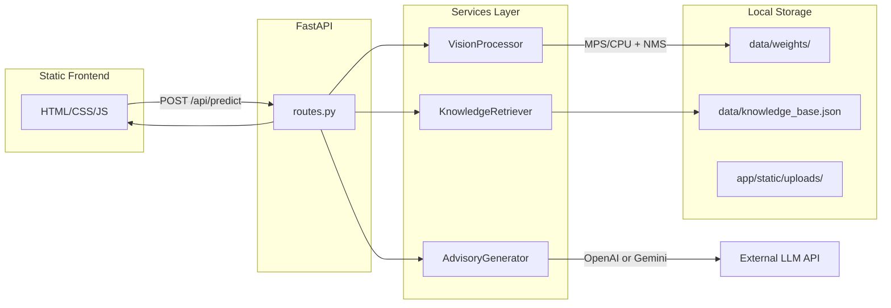
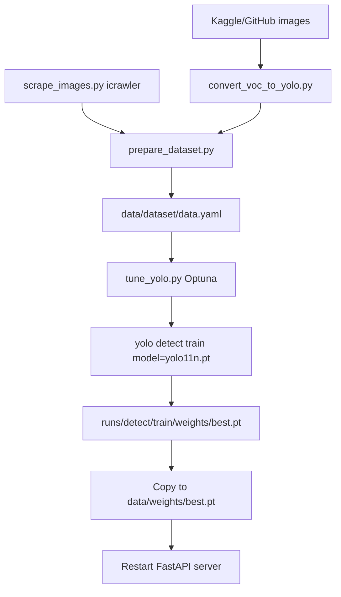

# FoodSense-MY Architecture

## System Overview

FoodSense-MY is a modular FastAPI application that detects 6 Malaysian food dishes in uploaded images and provides nutritional advisory information powered by a local JSON knowledge base and an optional LLM (formatting layer only).

## Target Classes (6)

| Class Key | Display Name |
|-----------|-------------|
| `nasi_lemak` | Nasi Lemak |
| `roti_canai` | Roti Canai |
| `char_kuey_teow` | Char Kuey Teow |
| `chicken_rice` | Chicken Rice |
| `laksa` | Laksa |
| `mee_goreng` | Mee Goreng |

## Request Flow

1. User uploads a food image via the web UI.
2. `routes.py` validates the upload and saves it to `app/static/uploads/`.
3. `VisionProcessor` preprocesses with OpenCV, runs YOLOv11n on MPS/CPU with explicit NMS (`conf=0.5`, `iou=0.45`).
4. `KnowledgeRetriever` looks up each detected class in `data/knowledge_base.json`.
5. `AdvisoryGenerator` formats verified JSON data via LLM (or template fallback).
6. Response includes detections, nutrition, advisory text, and a mandatory disclaimer.

## Module Responsibilities

| Module | Class | File | Responsibility |
|--------|-------|------|----------------|
| Entry point | — | `app/main.py` | FastAPI app, lifespan, static file mounting, CORS |
| Routes | — | `app/api/routes.py` | `/api/health`, `/api/predict`, `/api/classes` with DI |
| Config | `Settings` | `app/core/config.py` | Environment variables, TARGET_CLASSES |
| Security | — | `app/core/security.py` | Upload validation, optional API key check |
| Schemas | — | `app/models/schemas.py` | Pydantic request/response models |
| Vision | `VisionProcessor` | `app/services/vision_service.py` | OpenCV preprocessing, YOLOv11n + NMS on MPS/CPU |
| Data | `KnowledgeRetriever` | `app/services/data_service.py` | JSON knowledge base loading and lookup |
| LLM | `AdvisoryGenerator` | `app/services/llm_service.py` | LLM as formatting-only layer |
| Frontend | — | `app/static/` | Upload UI, results display |

## Environment Variables

| Variable | Description | Default |
|----------|-------------|---------|
| `LLM_PROVIDER` | `openai` or `gemini` | `openai` |
| `OPENAI_API_KEY` | OpenAI API key | — |
| `OPENAI_MODEL` | OpenAI model | `gpt-4o-mini` |
| `GEMINI_API_KEY` | Gemini API key | — |
| `GEMINI_MODEL` | Gemini model | `gemini-2.0-flash` |
| `MODEL_WEIGHTS_PATH` | YOLO weights path | `data/weights/best.pt` |
| `KNOWLEDGE_BASE_PATH` | Nutrition JSON path | `data/knowledge_base.json` |
| `CONFIDENCE_THRESHOLD` | NMS confidence threshold | `0.5` |
| `IOU_THRESHOLD` | NMS IoU threshold | `0.45` |
| `DEVICE` | Compute device (`auto`, `mps`, `cpu`) | `auto` |
| `MAX_UPLOAD_SIZE_MB` | Max upload size | `10` |
| `API_KEY_ENABLED` | Require API key | `false` |
| `API_KEY` | API key value | — |

## Training to Deployment Workflow

### Steps

1. **Convert annotations:** `python training_scripts/convert_voc_to_yolo.py --voc-dir ... --images-dir ...`
2. **Scrape images (optional):** `python training_scripts/scrape_images.py --output-dir data/raw_images`
3. **Prepare splits:** `python training_scripts/prepare_dataset.py --source-dir data/yolo_dataset --output-dir data/dataset`
4. **Tune hyperparameters:** `python training_scripts/tune_yolo.py --data data/dataset/data.yaml --n-trials 20`
5. **Train:** `yolo detect train model=yolo11n.pt data=data/dataset/data.yaml epochs=100 imgsz=640`
6. **Deploy weights:** `cp runs/detect/train/weights/best.pt data/weights/best.pt`
7. **Run:** `uvicorn app.main:app --reload --host 0.0.0.0 --port 8000`

## LLM Safety Design

- Verified nutrition numbers come exclusively from `knowledge_base.json`.
- The LLM acts as a **text-formatting layer only** — it must not invent calories, macros, ingredients, or medical advice.
- A fixed `DISCLAIMER` string is always returned server-side in the JSON response.
- A template-based fallback is used when API keys are missing or LLM calls fail.

## PyTorch / MPS Notes

- On Apple Silicon Macs, `VisionProcessor` auto-selects `mps` device for YOLOv11n inference.
- Falls back to `cpu` when MPS is unavailable.
- Override with `DEVICE=mps` or `DEVICE=cpu` in `.env`.
- `ReproducibilityManager` in `training_scripts/utils.py` fixes seeds across random, numpy, and torch (including MPS).

## Development Notes

- Until custom weights are trained, the app falls back to Ultralytics pretrained `yolo11n.pt` (COCO classes).
- Model and knowledge base are loaded once at startup via FastAPI lifespan.
- Uploaded images are stored in `app/static/uploads/` and served at `/uploads/`.
